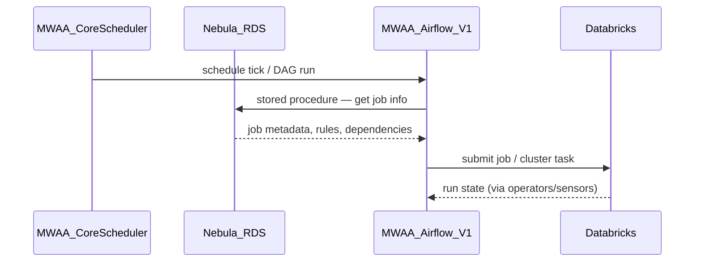
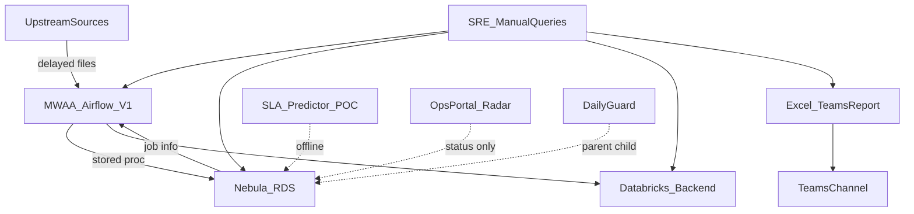
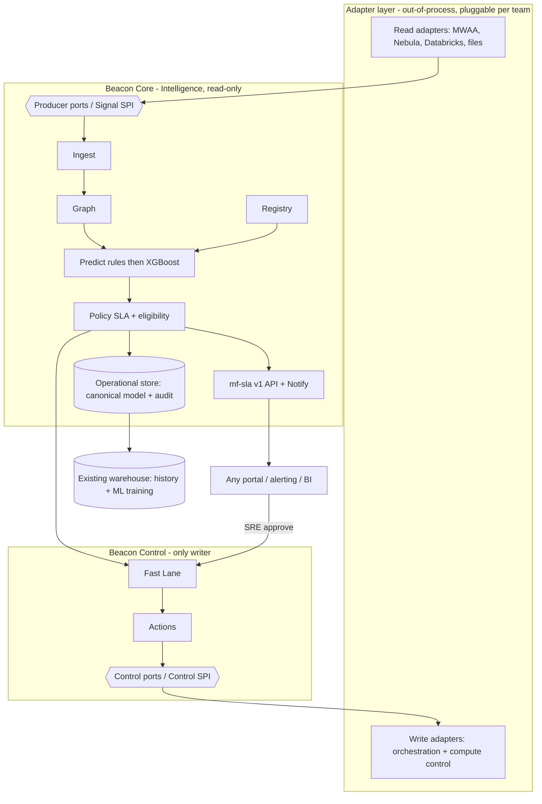
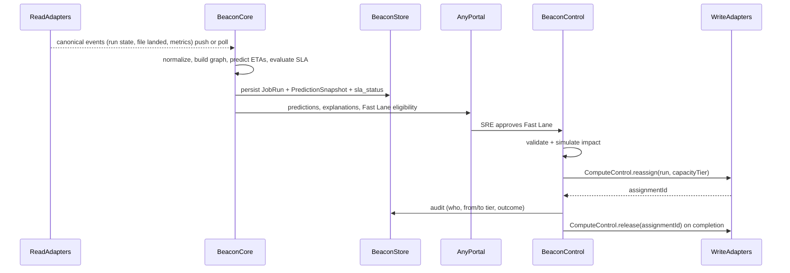

# Batch Orchestration Enhancement — Architecture

**Document version:** 3.0  
**Status:** Draft — architecture locked (pluggable hexagonal control plane)  
**Audience:** New joiners (interns, graduates, experienced hires) first; then platform engineering, SRE, data platform, Ops Portal team, MIS/business consumers  
**Related:** [Book of Work](./batch-orchestration-book-of-work.md)

---

## 0. Start here — a 5-minute primer

> **New to the team?** Read this section and §1–§3 first. You need **no prior knowledge** of our systems. Anything marked *Deep dive* is safe to skip on a first read.

### What this project is, in one paragraph

Every night and throughout the day, the bank runs thousands of automated data jobs — things like "calculate yesterday's cash position" or "prepare the earnings numbers." Each has a **deadline** (an *SLA*) because people and downstream systems are waiting for the results. Today, when something is running late, an engineer has to manually check several systems and guess whether we'll still finish on time, then post an update in a chat channel. **This project builds software that watches all those jobs, predicts whether each will meet its deadline, warns us early when one is at risk, and lets us take action to recover — before the deadline is missed.**

### The handful of words you'll keep seeing


| Word                  | Plain meaning                                                                               |
| --------------------- | ------------------------------------------------------------------------------------------- |
| **Batch job**         | An automated task that processes data on a schedule (not a person clicking buttons).        |
| **Function**          | A business-meaningful group of jobs (e.g. "Daily Core"). The thing that has a deadline.     |
| **SLA**               | The promised deadline for a function (e.g. "done by 02:00 PM UTC").                         |
| **Upstream file**     | A data file we wait for before a job can start. If it's late, everything behind it is late. |
| **Cluster / compute** | The machines that actually run a job. Bigger/faster compute can finish sooner — sometimes.  |
| **Orchestrator**      | The scheduler that decides what runs when (ours is MWAA / Airflow).                         |
| **AtRisk**            | Our label for "predicted to miss its SLA unless something changes."                         |


### One analogy that explains the whole system

Think of **trains running on a line toward a station (the deadline)**. Some trains (jobs) are delayed because an earlier train was late (a late file), or the track is congested (busy compute). Our system is the **signal tower / lighthouse** beside the line — hence the codename **Beacon**. It doesn't drive the trains; it **watches them, predicts which will arrive late, raises a warning early**, and can open a **Fast Lane** (extra capacity) for the most important trains so they still arrive on time.

### What the system does, in three steps

1. **Observe & predict** — pull live status from the systems that run the jobs, and predict each function's finish time.
2. **Evaluate & warn** — compare the prediction to the SLA; if it's *AtRisk*, surface it in the portal and alerts with *why*.
3. **Act (with a human's OK)** — offer controlled actions, e.g. **Fast Lane** (give a job more compute) or reschedule, all approved and audited.

### How to read the rest of this document

- **New joiners / interns:** §0 → §1 (summary) → §2 (how a batch is structured) → §3 (how things work today). That gives you a solid mental model. Stop there on day one.
- **Engineers building it:** continue into §4 (target architecture) → §5 (how prediction works) → §7–§9 (portal and actions).
- **Deep-divers / contract authors:** §6 is the precise data contract and interfaces (contains code).
- **Stuck on a term?** Jump to the **Glossary (§14)** any time.

---

## 1. Executive summary

### 1.1 Problem statement

> **In plain terms:** we run thousands of deadline-bound jobs, but today we find out a deadline is at risk too late and have no consistent way to recover. We want to *see* risk early and *act* on it.

The organization runs roughly **2,000 batch jobs** with **SLA deadlines** for downstream MIS, business, and regulatory consumers (e.g. earnings, cash position, JPMC reporting chains). Jobs are orchestrated through **Managed Flow** capabilities; our team executes on **Databricks** (compute backend) with orchestration via **MWAA** (Managed Workflows for Apache Airflow) and **Nebula** (a proprietary **RDS** database that holds most orchestration definitions and business rules).

Today:

- **Upstream source files** arrive late, delaying batch start and causing **cascading SLA risk** (similar to delayed trains on a single track).
- **Shared Databricks clusters** are sometimes overwhelmed; jobs queue even when SREs expect them to run.
- **SRE manually queries** MWAA, Nebula RDS, and Databricks, builds **Excel**, and posts status to **Teams**—experience-based estimates, not consistent science.
- An **XGBoost SLA Predictor POC** uses historical run data plus encoded operational knowledge but runs **offline** and was trained on a **limited time window**.
- **Ops Portal Radar** (D3JS visualizer) and **Daily Guard** show job status but lack **predicted finish**, **SLA risk**, **Fast Lane** indicators, and **in-portal actions**.

This is slow, error-prone, not self-service, and reactive. The problem has **two halves**, both in scope:

- **Visibility gap** — status is reactive and manual; SLA risk is discovered too late to recover.
- **Control gap** — even when risk is seen, there is no controlled, audited way to prioritize compute or realign work before the deadline.

One-sentence framing: *for SLA-bound batch jobs, no one gets a reliable, self-service answer to "will we make SLA, and if not, what do we do about it?"*

> **Scope note (v3.0):** MWAA + Nebula + Databricks is **our team's stack and the first deployment**, but it is **not** baked into the design. The control plane is built **platform-agnostic and pluggable** (see §4): these systems are the first set of adapters behind stable ports, and any other team can adopt the product with their own orchestrator, compute, and metadata sources.

### 1.2 Vision

Build a **Batch Intelligence & Control Plane (BICP)**—a **platform-agnostic, pluggable** product positioned externally as a **Managed Flow SLA capability**—that runs **one control loop**:

> **observe → predict → evaluate SLA → recommend → act (with approval) → show the result**

1. **Predicts** when each batch will **start** and **finish**, with explainable confidence (rules first, XGBoost second).
2. **Surfaces SLA status** in **any portal** (today: Radar, Daily Guard, SLA Command Center)—replacing Excel/Teams as the source of truth.
3. **Acts** through controlled, audited write-back: **Fast Lane** (priority capacity reassignment when SLA is at risk and the job is **compute-bound**) and reschedule/realignment.
4. Exposes **decision transparency** (why a job moved lanes, predicted vs actual, criticality).

**Both halves — visibility and control — are committed deliverables**, and Fast Lane is sequenced **early**, not deferred (see [Book of Work](./batch-orchestration-book-of-work.md)).

**The product is the canonical contract + ports, not the stack.** MWAA, Nebula, and Databricks are the **first adapter bundle** behind those ports; they remain our execution stack but can be swapped with zero core changes. Other teams adopt the same core with their own adapters (e.g. Control-M/AutoSys + Snowflake/EMR).

### 1.3 Naming — why Beacon?

This initiative uses several names at different layers. **Beacon** is the name for the **backend intelligence services** that power the vision above—not the program title, not the portal UI, and not a replacement for Nebula or Managed Flow.

#### What a beacon is

In everyday English, a **beacon** is a **fixed signal that guides or warns**—most familiar as a lighthouse beam that helps ships see danger and stay on course before they run aground. The word also applies to emergency transmitters that broadcast *“help is needed here”* and to navigation aids that answer *“where am I relative to the route?”*

That meaning maps directly to the problem in §1.1: today, SLA risk is discovered **late**, after SREs manually query systems and assemble status in Excel. Downstream consumers wait on Teams posts instead of seeing a credible early warning. The control plane exists to **watch the fleet**, **signal risk while there is still time to act**, and **guide recovery**—not to replace the engines that run the jobs.

#### How Beacon fits the vision

The vision in §1.2 is intentionally about **outcomes** (predict, surface, act, explain). **Beacon** is the **platform-agnostic core** that delivers those outcomes. It is organized as **two services plus a pluggable adapter layer** (full detail in §4):


| Vision capability                          | Where it lives                                                                                                                                    |
| ------------------------------------------ | ------------------------------------------------------------------------------------------------------------------------------------------------- |
| **Observe / Predict / Evaluate / Explain** | **Beacon Core (Intelligence)** — read-only brain: Ingest, Graph, Registry, Predict (rules + XGBoost), Policy (SLA status + Fast Lane eligibility) |
| **Act** — Fast Lane and reschedule         | **Beacon Control** — the only writer: Fast Lane + Actions, via controlled, audited write-back                                                     |
| **Connect to any platform**                | **Adapter layer** — out-of-process adapters implementing the Producer / Control SPIs (MWAA, Nebula, Databricks first)                             |
| **Surface to any consumer**                | The `mf-sla v1` API + Notify feed portals, alerting, BI                                                                                           |


The **trains-and-lanes** metaphor (normal lane vs **Fast Lane**) describes how users *see* jobs in a portal. **Beacon** is the *signaling and control layer* above the track: continuous visibility into position, ETA, and danger—plus the approved levers to recover—so SRE and business users do not have to infer status from experience alone.

#### Naming stack (what to call what)


| Layer                   | Name                                          | Audience                               | Purpose                                                                                                           |
| ----------------------- | --------------------------------------------- | -------------------------------------- | ----------------------------------------------------------------------------------------------------------------- |
| **Program**             | Batch Intelligence & Control Plane (**BICP**) | Engineering leadership, delivery       | Initiative scope and architecture                                                                                 |
| **External capability** | **Managed Flow SLA**                          | Cross-team stakeholders, MIS, business | Flow-agnostic brand; not “Nebula-only”                                                                            |
| **Backend services**    | **Beacon** *service*                          | Platform engineering, SRE (technical)  | Service prefix: `beacon-core`, `beacon-control`, `beacon-adapter-`* (Predict/Policy/etc. are modules inside Core) |
| **Portal experience**   | **SLA Command Center**                        | SRE, MIS, BCA, business                | Extensions to Radar and Daily Guard—the surface users actually open                                               |
| **Model**               | **SLA Predictor**                             | Data science, SRE                      | XGBoost finish-time model (POC → production)                                                                      |


**Beacon is an engineering codename**, not the headline for stakeholder decks. Lead with **Managed Flow SLA** or **Batch SLA Intelligence** externally; use **SLA Command Center** when describing the portal; use **Beacon** when partitioning backend repos and APIs.

#### What Beacon is not

- **Not an orchestrator** — orchestrators (MWAA, Control-M, …), metadata stores (Nebula, …), and compute (Databricks, Snowflake, …) still execute jobs; Beacon observes and, when approved, requests changes through adapters.
- **Not a new portal** — any portal (Radar/Daily Guard today) remains the UI; Beacon supplies data and actions via the `mf-sla v1` API.
- **Not tied to our stack** — Beacon depends only on the **canonical contract** and **ports**; MWAA/Nebula/Databricks are the first adapter bundle, swappable with zero core changes.
- **Not eight services** — earlier drafts named eight; v3.0 collapses them into **Beacon Core**, **Beacon Control**, and a **pluggable adapter layer**. Full structure: §4.

#### Why this name works

1. **Matches the shift from reactive to proactive** — A beacon warns *before* impact; the initiative targets detection from hours to minutes.
2. **Complements existing metaphors** — Trains run on lanes; the beacon watches the line and flags which trains need Fast Lane.
3. **Separates concerns in conversation** — “MWAA schedules it, Nebula defines it, Databricks runs it, Beacon watches it, the portal shows it” is easier than overloading one product name.
4. **Scales as a service prefix** — `beacon-core`, `beacon-control`, `beacon-adapter-`* group related code by service and adapter.

If the name is challenged in review, the one-line answer is: **Beacon is the early-warning and guidance layer for batch SLAs—the backend that turns manual guesswork into measured signal.**

### 1.4 Target outcomes


| Metric                            | Target                     | Baseline                   |
| --------------------------------- | -------------------------- | -------------------------- |
| Manual SRE status-reporting time  | ≥80% reduction             | Phase 0 measurement        |
| SLA on-time completion rate       | Measurable improvement     | Phase 0 (90-day history)   |
| Mean time to detect at-risk batch | Hours → minutes            | Manual query + Excel cycle |
| MIS/business self-service         | Portal replaces Teams wait | Ad hoc channel posts       |
| Fast Lane SLA saves               | Documented pilot wins      | Phase 2–3                  |


### 1.5 Design principles

1. **Platform-agnostic core (central principle)** — The core depends **only** on the canonical `mf-sla v1` contract and on **ports**; no orchestrator/compute/metadata system is baked in. MWAA + Nebula + Databricks are the **first adapter bundle**, not assumptions. Validated on paper against Control-M/AutoSys + Snowflake/EMR so the seams are not Airflow-shaped (§4.4).
2. **Pluggable by any team** — Reusable as a **deployable product**: another team runs their own instance with their own adapters and config. Adapters are **out-of-process services** over a network SPI, so they can be written in any language.
3. **Composed by port, not by platform** — Ports are capabilities; one adapter may implement several (Control-M serves orchestration + metadata + SLA in one; MWAA + Nebula split them). The core negotiates capabilities and degrades gracefully.
4. **Explainable predictions** — Every ETA shows factors (file delay, dependency cascade, resource queue, compute index, historical runtime); the explanation is derived from unmet dependencies, not a separate feature.
5. **Human-in-the-loop control** — Fast Lane and reschedule require SRE approval; actions are audited, reversible, with auto tear-down. Upstream data fixes, validation failures, and code deploys stay manual.
6. **Normal day vs rainy day** — Prediction targets typical upstream-delay and capacity scenarios; exceptional failures are SRE-handled, not fully automated.
7. **Any portal, any consumer** — Beacon serves the `mf-sla v1` API; portals (Radar/Daily Guard today), alerting, and BI are consumers. No parallel tool; the portal stays portal-owned.
8. **Rules first, ML second** — Ship rules-based prediction; the XGBoost SLA Predictor shadows then promotes behind the same internal interface (`modelVersion`); rules fallback always available.

### 1.6 Stakeholder alignment (2026 discussion)


| Area                        | Role                                                                          |
| --------------------------- | ----------------------------------------------------------------------------- |
| **SLA Predictor / ML**      | XGBoost POC, prediction features, model tuning                                |
| **Ops Portal team**         | Radar owner; peer solutions (~4 related tools); portal integration            |
| **SRE operations contact**  | Day-to-day manual process, rainy-day behavior, Daily Guard usage              |
| **Compute profiling**       | Compute-bound classification, cluster sizing inputs                           |
| **MIS / BCA consumers**     | Primary read-only audience for batch SLA status                               |


---

## 2. Domain model — batch anatomy

Understanding hierarchy is required for prediction, visualization, and Fast Lane scope.

```
Function          (e.g. Daily Core — parent batch in Daily Guard)
  └── Subfunction
        └── Core job
              └── Need job(s)
```


| Level           | Example                         | Notes                                         |
| --------------- | ------------------------------- | --------------------------------------------- |
| **Function**    | Daily Core                      | Parent row in Daily Guard; primary SLA anchor |
| **Subfunction** | Logical grouping under function |                                               |
| **Core job**    | Executable unit on cluster      | Often where cluster SKU is assigned           |
| **Need job**    | Child/supporting job            | Usually 1:1 with parent; rare shared bundles  |


- **Dependencies** exist in **Nebula RDS** orchestration metadata (and partially in MWAA DAG structure); Radar shows status colors (on hold, waiting) but **not full dependency graph** today.
- **Prediction** can bind SLA to function (parent) while computing critical path through core/need jobs.

---

## 3. Current state architecture

### 3.1 Platform stack (MWAA + Nebula RDS + Databricks)

Our batch platform has **three layers**. Beacon must ingest from all three; most **orchestration logic** lives in Nebula, not in Airflow DAG code.


| Layer                              | Technology                                      | Role                                                                                                                                                           |
| ---------------------------------- | ----------------------------------------------- | -------------------------------------------------------------------------------------------------------------------------------------------------------------- |
| **Compute backend**                | **Databricks**                                  | Where batch jobs actually run—clusters, job runs, duration, queue, cost                                                                                        |
| **Orchestration engine**           | **MWAA** (Managed Workflows for Apache Airflow) | Schedules and triggers work; hosts Airflow **V1** (majority) with **V2** for a **subset** of batch types only                                                  |
| **Orchestration metadata & rules** | **Nebula** (proprietary **RDS**)                | Custom database holding **most orchestration definitions**—job hierarchy, holiday calendars, business rules, dependencies—not primarily in Airflow Python DAGs |


#### Runtime trigger flow

The **entry point** is the **core scheduler** in Airflow (MWAA):

```
1. MWAA core scheduler fires (cron / trigger)
2. Scheduler invokes Nebula RDS stored procedure(s) → job information, rules, calendars
3. MWAA tasks submit work to Databricks (and sensors wait on files/upstream)
4. Databricks executes; run metrics flow back via APIs / logs
```




**Airflow V1 vs V2:** Most batches still run on **Airflow V1** semantics in MWAA. A **partial V2 upgrade** applies only to certain batch types—Beacon ingestion and adapters must handle **both** API/event shapes where they diverge.

### 3.2 Components (current state)


| Component             | Role today                                                                                                                           |
| --------------------- | ------------------------------------------------------------------------------------------------------------------------------------ |
| **Upstream sources**  | Landing-zone files; arrival times vary                                                                                               |
| **MWAA**              | Orchestration engine; core scheduler is the batch **entry point**                                                                    |
| **Nebula RDS**        | Proprietary DB: orchestration definitions, stored procedures, holiday calendars, business rules—**source of truth for job metadata** |
| **Databricks**        | **Backend compute**—shared pools, multiple SKUs, spin up/down                                                                        |
| **Managed Flow**      | Broader orchestration brand other teams use; BICP targets this label externally                                                      |
| **SRE workflow**      | Manual queries across MWAA + Nebula + Databricks → Excel → Teams                                                                     |
| **SLA Predictor POC** | XGBoost on limited months of Nebula/MWAA history + operational features                                                              |
| **Ops Portal Radar**  | D3JS job visualizer (~2000 jobs); Ops Portal team owner                                                                              |
| **Daily Guard**       | Parent/child job table view (aligned with Nebula function hierarchy)                                                                 |


### 3.3 Why Nebula exists (internal context)

Nebula is **not** a thin wrapper around Airflow—it is a **proprietary RDS** layer where the team centralizes orchestration that does not belong in generic Airflow DAGs:

- **Stored procedures** called by the MWAA core scheduler to resolve **job information** at trigger time
- Per-engine and per-sub-job **holiday calendars**
- **Time-driven (cron)** and dependency rules maintained in the database
- Centralized validation/orchestration logic so application teams don't duplicate rules

Airflow (MWAA) provides **scheduling and execution plumbing**; **Nebula RDS holds the business orchestration model**. Other teams often manage batches independently on Managed Flow; they may not use Nebula. **BICP must not be marketed as Nebula-only.**

### 3.4 Pain points


| Who feels it       | Pain                                                                                                     |
| ------------------ | -------------------------------------------------------------------------------------------------------- |
| **Business / MIS** | Can't self-serve "will we make SLA?" — waits on SRE; Teams updates go stale or wrong                     |
| **SRE**            | Manually stitches MWAA + Nebula RDS + Databricks into Excel → Teams; ETAs are guesswork, not measurement |
| **SRE**            | Late files, cluster queues, and dependency cascades aren't visible early enough to react                 |
| **Platform**       | Signals are fragmented; the prediction POC runs offline, not in the portal or alerts                     |
| **Platform**       | No controlled way to prioritize compute-bound critical work (Fast Lane) — later, not MVP                 |


### 3.5 Current-state diagram




---

## 4. Target state architecture

> **In plain terms:** we split the system into a **brain** that only thinks and reads (Beacon Core), a **hand** that is the only part allowed to change anything (Beacon Control), and **plugs/translators** that connect to each real system (adapters). Swapping a platform means writing a new plug — the brain doesn't change. That "plug" idea is the *ports-and-adapters* (hexagonal) pattern below.

**Pattern: ports-and-adapters (hexagonal).** A platform-agnostic core depends only on the canonical `mf-sla v1` contract (§6) and on **ports**. Every platform-specific system lives behind an **out-of-process adapter** that implements one or more ports. The product is the **contract + ports**, not the stack; MWAA/Nebula/Databricks are the first adapter bundle.

### 4.1 Logical services

Three logical services (the eight components of earlier drafts are now internal modules):


| Service                        | Role                                                                                                                                                   | Internal modules                                                                    |
| ------------------------------ | ------------------------------------------------------------------------------------------------------------------------------------------------------ | ----------------------------------------------------------------------------------- |
| **Beacon Core** (Intelligence) | **Read-only brain.** Coordinates ingest, builds the graph, predicts, evaluates SLA + Fast Lane eligibility, serves the API. Never writes to platforms. | Ingest, Graph, Registry, Predict (rules + XGBoost), Policy, `mf-sla v1` API, Notify |
| **Beacon Control**             | **The only writer.** Validates, simulates, executes approved write-back, audits.                                                                       | Fast Lane (compute reassignment), Actions (reschedule tiers)                        |
| **Adapter layer** (pluggable)  | Out-of-process services implementing the Producer / Control SPIs for each platform.                                                                    | Reference: MWAA, Nebula, Databricks, file-landing                                   |


**SLA Command Center** (portal UI) is a **consumer** of the API, not a Beacon service. **Prediction is core-only** (rules + XGBoost behind one internal interface, selected by `modelVersion`).

### 4.2 The three SPI families

The product surface is the canonical contract plus three plug-point families (full interfaces in §6):


| SPI family       | Direction         | Ports                                                                                                       | Implemented by                                   |
| ---------------- | ----------------- | ----------------------------------------------------------------------------------------------------------- | ------------------------------------------------ |
| **Producer SPI** | signals in (read) | `OrchestrationSource`, `MetadataSource`, `ComputeSource`, `FileLandingSource`, optional `SlaRegistrySource` | read adapters                                    |
| **Control SPI**  | writes out        | `OrchestrationControl` (trigger/hold/rerun/reschedule…), `ComputeControl` (Fast Lane capacity reassignment) | write adapters (only Beacon Control holds these) |
| **Consumer SPI** | intelligence out  | `mf-sla v1` REST API, `NotificationSink`, event stream                                                      | portals, alerting, BI                            |


Each adapter publishes an `**AdapterManifest`** declaring which ports it implements and its capabilities (push vs poll; supported control verbs; read-only vs write-capable). The core **composes by port** and **negotiates capabilities** — one adapter may serve several ports (Control-M = orchestration + metadata + SLA), or ports may be split across adapters (MWAA + Nebula).

### 4.3 Target-state diagram




### 4.4 Event flow




### 4.5 Genericity validation (design-check, not built)

The ports were stress-tested on paper against a **Control-M/AutoSys + Snowflake/EMR** stack to ensure they are not Airflow-shaped. This forced the following into the contract (see §6):

- **No DAG assumption** — model is `JobRun` + typed `DependencyEdge` + logical `Function`; Airflow DAGs and Control-M condition graphs both map in.
- **Capacity, not clusters** — `ComputeControl` speaks opaque ordinal capacity tiers + estimated speedup (Databricks SKU / Snowflake warehouse / EMR instances).
- **Canonical `RunState`** — adapters map native states (e.g. AutoSys `ON_ICE` → `HELD`).
- **Capability negotiation** — pull vs push and supported control verbs differ per platform; the core degrades gracefully.

**Build policy:** build the generic core + ports and the **MWAA/Nebula/Databricks adapter bundle** first. Do **not** build Control-M/Snowflake adapters until a real second adopter exists (avoid speculative generality).

---

## 5. Prediction criteria

> **In plain terms:** to know if a job will be late, we estimate two things — *when it will start* (mostly driven by when its input file lands) and *how long it will run* (driven by data size and how busy the compute is). Start + duration vs the deadline tells us if it's *AtRisk*. The formulas below are just that idea written precisely.

### 5.1 Design scope: normal day vs rainy day


| Scenario                  | Frequency          | Prediction / automation                                       |
| ------------------------- | ------------------ | ------------------------------------------------------------- |
| **Normal day**            | Most business days | Upstream file late; cluster queue; dependency cascade         |
| **Rainy day**             | Exceptional        | Job failure (validation, bad upstream data, rare code deploy) |
| **Upstream fix required** | Occasional         | Talk to source team, fix data                                 |


Most daily SLA misses trace to **late start (Δ upstream)** and **capacity**, not daily code changes.

### 5.2 When will a batch start?

> *Deep dive — the formulas in §5.2–§5.5 are for engineers building the predictor. Safe to skip on a first read; the plain-terms summary above is enough for the mental model.*

```
predicted_start = max(
  scheduled_cron_time,
  latest_upstream_file_ready_time,
  latest_upstream_batch_finish_time,
  cluster_available_time,
  flow_unpause_time,
  holiday_calendar_block
)
```


| Signal                  | Source                                           | Use                               |
| ----------------------- | ------------------------------------------------ | --------------------------------- |
| Scheduled trigger       | MWAA scheduler + Nebula RDS (cron rules)         | Baseline                          |
| File arrival            | Landing-zone events, file catalog                | Delay vs p50/p90 expected arrival |
| Upstream job completion | MWAA task instances + Nebula dependency metadata | Dependency blocking               |
| Sensor / wait state     | MWAA sensors (V1/V2)                             | Waiting vs failed                 |
| Cluster queue           | Databricks queue, pool utilization               | Shared cluster overload           |
| Holiday calendar        | Nebula RDS business rules                        | Hard block                        |
| Historical start lag    | Warehouse features (MWAA + Nebula history)       | DOW/holiday patterns              |


**Cascade rule:** If head job starts at `T + Δ`, downstream critical path shifts by Δ unless parallel slack absorbs it (train-delay mental model).

### 5.3 When will a batch finish?

```
predicted_finish = predicted_start + predicted_runtime + buffer(uncertainty)
```


| Runtime input           | Description                                                 |
| ----------------------- | ----------------------------------------------------------- |
| Historical duration     | By function/core job, cluster SKU, data volume proxy        |
| Co-scheduled jobs       | Two jobs same slot → encoded in POC features                |
| Queue / retry overhead  | Spin-up, retries, pool pressure                             |
| Critical path           | Sum when SLA binds to last need job                         |
| Infrastructure mismatch | On-prem historical data **excluded** from DBX runtime model |


#### Model layers


| Layer                          | Implementation                                                                                  |
| ------------------------------ | ----------------------------------------------------------------------------------------------- |
| **Baseline rules**             | p50/p90 by job family; AtRisk if p90 > SLA                                                      |
| **SLA Predictor (POC → prod)** | XGBoost; features from MWAA/Nebula/Databricks history + human knowledge (slot contention, etc.) |
| **Fallback**                   | Rules always available if model low confidence or drift                                         |


Align feature set, retraining cadence, and shadow evaluation with the SLA Predictor POC track.

### 5.4 Compute index (Fast Lane gate)

Fast Lane is **not** “always spin a mega cluster.” Reassignment only when:

```
fast_lane_eligible =
  sla_status == AtRisk
  AND compute_index >= threshold
  AND upsize_sku_expected_savings > min_minutes
  AND job_criticality >= configured_tier
```


| Input                   | Purpose                                       |
| ----------------------- | --------------------------------------------- |
| **Compute index**       | Job compute-bound score (profiling) |
| **Current cluster SKU** | small / medium / large / xl                   |
| **SLA slack remaining** | Minutes to deadline vs predicted p90 finish   |
| **Criticality**         | User-assigned or registry default             |
| **Cost guardrail**      | Max spend per day / per tier                  |


**Fast Lane action:** Reassign to larger or dedicated cluster for **this run**, execute, **tear down** when complete.

### 5.5 SLA evaluation

```
sla_status = compare(predicted_finish, sla_deadline)
  → OnTrack | AtRisk | Breached | Unknown
```

**AtRisk** when `predicted_finish_p90 > sla_deadline` OR material file delay OR cascade Δ exceeds slack.

#### Explanation payload (example)

```json
{
  "function_id": "daily_core",
  "run_id": "2026-06-13T00:00:00+00:00",
  "predicted_start": "2026-06-13T06:22:00Z",
  "predicted_finish_p50": "2026-06-13T07:45:00Z",
  "predicted_finish_p90": "2026-06-13T08:10:00Z",
  "sla_deadline": "2026-06-13T08:00:00Z",
  "sla_status": "AtRisk",
  "confidence": "Medium",
  "compute_index": 0.82,
  "fast_lane_eligible": true,
  "factors": [
    {"type": "file_delay", "file": "landing/.../daily.csv", "expected_by": "06:00", "status": "absent"},
    {"type": "cascade_delta_minutes", "value": 22, "upstream_function": "ingest_raw"},
    {"type": "cluster_queue", "pool": "shared_standard", "queued_jobs": 4},
    {"type": "historical_runtime_p90", "minutes": 83, "cluster_sku": "standard_8"}
  ]
}
```

---

## 6. Canonical contract (`mf-sla v1`)

> **In plain terms:** this is the shared "dictionary" everything agrees on — what a Function, a Job, a Run, and a state mean — independent of any specific tool. Adapters translate each real system *into* this dictionary, so the brain only ever speaks one language. This is the most technical section.
>
> *Deep dive — the TypeScript interfaces below are the precise contract for engineers and adapter authors. New joiners can read the table of entity names and skip the code on a first pass.*

**The canonical contract is the product.** The core depends only on this versioned model and on the ports below; adapters map platform-specific data into it. It is the stable surface other teams code against.

### 6.1 Entities

Separate **definitions** (static) from **runs** (instances) — this is what lets Airflow (DAG/DagRun/Task/TaskInstance) and Control-M (job def / ordered run) both map in without privileging either.

```ts
// Identity: platform-namespaced so multiple sources can describe one thing
interface ExternalRef { source: SourceId; nativeId: string; nativeType?: string }
type Urn = string            // urn:mfsla:<source>:<type>:<nativeId>

// ---- Definitions ----
interface Function {         // the SLA-bearing anchor (e.g. "Daily Core")
  id: Urn; name: string; owner?: string; criticalityTier?: number
  refs: ExternalRef[]        // may merge orchestration + metadata sources
}
interface Job { id: Urn; functionId: Urn; name: string; role: "core"|"need"|"other"; refs: ExternalRef[] }

// ---- Runs ----
interface FunctionRun {
  id: Urn; functionId: Urn; businessDate: string
  slaDeadline?: string; slaStatus: "OnTrack"|"AtRisk"|"Breached"|"Unknown"
  predictedFinish?: PctTime; actualFinish?: string; state: RunState
}
interface JobRun {
  id: Urn; jobId: Urn; functionRunId: Urn; state: RunState
  waitReasons?: DependencyEdge[]      // unmet deps = the AtRisk explanation
  actualStart?: string; actualFinish?: string
  predictedFinish?: PctTime; compute?: ComputeProfile
}
interface PctTime { p50: string; p90: string }

interface DependencyEdge {            // no DAG assumption
  toRun: Urn
  type: "TIME" | "FILE" | "UPSTREAM" | "RESOURCE" | "EXTERNAL"
  satisfied: boolean; satisfiedAt?: string
  detail: Record<string, unknown>     // {expectedBy,filePattern} | {upstreamRunId,requiredState} | {resourceId}
}
interface ResourceConstraint {        // Airflow pool == Control-M control resource == Snowflake warehouse queue
  id: Urn; kind: "POOL"|"LOCK"|"QUOTA"|"WAREHOUSE"
  capacity?: number; inUse?: number; queueDepth?: number
}
interface ComputeProfile {            // capacity, not "cluster SKU"
  backend: SourceId
  capacityTier: { label: string; ordinal: number }   // opaque to core, but ordered
  computeIndex?: number               // 0..1 compute-bound score (does upsize help?)
  costRate?: number; durationActual?: number; queueTime?: number
}
interface PredictionSnapshot {        // append-only history; modelVersion makes the predictor swappable
  runId: Urn; producedAt: string
  predictedStart: PctTime; predictedFinish: PctTime
  confidence: "Low"|"Medium"|"High"; modelVersion: string   // "rules-v1" | "xgb-2026.06"
  factors: { type: string; detail: Record<string, unknown> }[]
}
```

### 6.2 RunState — canonical enum

```ts
type RunState =
  | "PENDING"    // known, not yet startable (future schedule)
  | "WAITING"    // startable but blocked — see waitReasons (file/upstream/resource/time/hold)
  | "QUEUED"     // submitted, awaiting compute
  | "RUNNING" | "SUCCEEDED" | "FAILED" | "TERMINATED"
  | "SKIPPED" | "HELD" | "UNKNOWN"
```

Each adapter maps native states into this enum — e.g. Airflow `deferred`(sensor) → `WAITING`; AutoSys `ON_ICE`/`ON_HOLD` → `HELD`, `INACTIVE` → `PENDING`; Snowflake task `SCHEDULED` → `PENDING`. **The core never sees native states.**

### 6.3 Ports (the three SPI families)

Adapters publish an `AdapterManifest` (which ports, push/poll, supported control verbs, read/write); the core composes by port.

```ts
// ===== Producer SPI (read) =====
interface OrchestrationSource { listFunctionRuns(w: TimeWindow): Promise<FunctionRun[]>; listJobRuns(r): Promise<JobRun[]> }
interface MetadataSource     { listFunctions(): Promise<Function[]>; getDependencies(r): Promise<DependencyEdge[]>; getCalendars?(): Promise<Calendar[]> }
interface ComputeSource      { getRunCompute(jobRunId: Urn): Promise<ComputeProfile>; getResource(id: Urn): Promise<ResourceConstraint> }
interface FileLandingSource  { getExpectations(functionId: Urn): Promise<FileExpectation[]> }   // push: emits FileArrived
interface SlaRegistrySource  { getSla(functionId: Urn): Promise<{deadline: string; criticality: number}> }  // optional; else built-in Registry

// ===== Control SPI (write) — Beacon Control only; capability-flagged =====
type ControlVerb = "trigger"|"hold"|"release"|"rerun"|"reschedule"|"setPriority"|"forceComplete"
interface OrchestrationControl {
  supports(v: ControlVerb): boolean
  execute(v: ControlVerb, run: Urn, args?): Promise<ActionResult>
  simulate?(v: ControlVerb, run: Urn, args?): Promise<ImpactEstimate>
}
interface ComputeControl {              // Fast Lane lives here
  getCapacityTiers(backend: SourceId): Promise<CapacityTier[]>
  estimateSpeedup(jobRunId: Urn, target: CapacityTier): Promise<{minutesSaved: number; cost: number}>
  reassign(jobRunId: Urn, target: CapacityTier): Promise<{assignmentId: string}>
  release(assignmentId: string): Promise<void>     // auto tear-down
}

// ===== Consumer SPI (out) =====
interface NotificationSink { capabilities(): ChannelKind[]; send(e: SlaEvent): Promise<void> }  // TEAMS|SLACK|PAGERDUTY|SERVICENOW
// + event stream: SlaStatusChanged, AtRiskRaised, ActionExecuted
```

### 6.4 Storage

- **Operational store** (Beacon Core): the canonical model above + immutable action audit. Generic — no platform tables leak in.
- **Existing data warehouse**: historical runs + features for ML training (exported from the operational store).

### 6.5 REST API surface (`/mf-sla/v1`)

Consumer-facing; avoid platform names (e.g. `nebula`) in routes.


| Endpoint                             | Method | Purpose                        |
| ------------------------------------ | ------ | ------------------------------ |
| `/functions`                         | GET    | List functions with SLA status |
| `/functions/{id}/runs/{runId}`       | GET    | Run detail + prediction        |
| `/functions/{id}/runs/{runId}/graph` | GET    | Dependency graph               |
| `/predictions/{runId}`               | GET    | Latest snapshot + factors      |
| `/recommendations/at-risk`           | GET    | SRE queue                      |
| `/fast-lane/eligibility/{runId}`     | GET    | Compute index + gate result    |
| `/fast-lane/assignments`             | POST   | Approve Fast Lane              |
| `/simulations`                       | POST   | What-if                        |
| `/actions`                           | POST   | Reschedule / priority change   |
| `/notifications/digest`              | POST   | Scheduled digest (any channel) |
| `/metrics/sla`                       | GET    | Leadership rollup              |


---

## 7. Consumer surface — SLA Command Center

The portal is a **Consumer of the `mf-sla v1` API**, not a Beacon service. Our first consumer extends **Radar** (D3JS) and **Daily Guard** owned by the Ops Portal team—not a greenfield UI—but any portal, alerting, or BI tool can consume the same API.

### 7.1 Visual metaphor

**Trains and lanes:** Jobs run on normal lanes; **Fast Lane** shows jobs prioritized for SLA recovery. Extra speed comes from **reassigning to a higher compute capacity tier** for the run (via the `ComputeControl` port), not laying new physical track.

### 7.2 Daily Guard enhancements


| Column / control           | Purpose                     |
| -------------------------- | --------------------------- |
| Parent function (existing) | Batch anchor                |
| Child jobs (existing)      | Core / need jobs            |
| **Predicted finish**       | p50 / p90                   |
| **SLA status chip**        | OnTrack / AtRisk / Breached |
| **Lane indicator**         | Normal vs Fast Lane         |
| **Criticality**            | Editable tier (SRE / owner) |
| **Move to Fast Lane**      | Manual action when eligible |


### 7.3 Radar enhancements

- Per-node: predicted finish, AtRisk styling, Fast Lane badge
- Status colors retained (on hold, waiting); add **danger** state for SLA breach risk
- Dependency hints on drill-down (coordinate with existing status-ski behavior)

### 7.4 Audiences


| Audience                 | Needs                                            |
| ------------------------ | ------------------------------------------------ |
| **MIS / BCA / business** | Self-service SLA board; replace Teams/Excel wait |
| **SRE**                  | At-risk queue, Fast Lane, reschedule, audit      |
| **Leadership**           | Weekly SLA %, delay taxonomy                     |


### 7.5 Replace Excel + Teams


| Today                         | Target                                                    |
| ----------------------------- | --------------------------------------------------------- |
| SRE Excel → Teams             | Portal is source of truth; optional Teams digest from API |
| “Job will be done by X” posts | Predicted finish visible in Radar/Daily Guard             |
| No criticality flag           | Registry + UI assignment                                  |


---

## 8. Fast Lane (the `ComputeControl` action)

> **In plain terms:** Fast Lane is the "give this important, behind-schedule job more horsepower so it still makes its deadline" button — like opening an HOV/express lane for the trains that need it most. It only applies to jobs that qualify, and a human approves it.

### 8.1 Concept

Like an **HOV lane**: reserved path for jobs that **meet eligibility** (critical + compute-bound + AtRisk) so they finish before SLA breach. Implemented entirely through the `**ComputeControl` port** in Beacon Control — the core reasons about **opaque capacity tiers + estimated speedup**, never "cluster SKU". A Databricks adapter maps a tier to a bigger cluster; a Snowflake adapter to a larger warehouse; an EMR adapter to more instances.

### 8.2 Flow

```mermaid
flowchart LR
  Predict[AtRiskPredicted]
  Index[ComputeIndexCheck]
  Estimate[ComputeControl.estimateSpeedup]
  Approve[SREApproval]
  Reassign[ComputeControl.reassign target tier]
  Run[ExecuteOnFastLane]
  Teardown[ComputeControl.release teardown]
  Audit[AuditLog]

  Predict --> Index
  Index -->|eligible| Estimate
  Index -->|not compute bound| Predict
  Estimate --> Approve
  Approve --> Reassign --> Run --> Teardown --> Audit
```




### 8.3 Guardrails

- No Fast Lane if compute_index below threshold (upsize won't help)
- Cost ceiling per day / domain
- Full audit: who approved, from/to capacity tier, outcome vs prediction
- Agent-assisted recommendation later; **manual approval first**

---

## 9. Reschedule and realignment (the `OrchestrationControl` actions)

Beyond Fast Lane, Beacon Control exposes orchestration write-back through the `**OrchestrationControl` port** (verbs are capability-flagged — an adapter advertises only what its platform supports):


| Tier | Action                          | `ControlVerb`      | Approval        |
| ---- | ------------------------------- | ------------------ | --------------- |
| 1    | Trigger / rerun / config change | `trigger`, `rerun` | SRE             |
| 2    | Priority / dedicated resource   | `setPriority`      | SRE or policy   |
| 3    | Pause non-critical functions    | `hold` / `release` | SRE + playbook  |
| 4    | Logical-date / schedule shift   | `reschedule`       | Manual playbook |


Beacon Control: **validate → `simulate` downstream SLA impact → `execute` via the write adapter → audit**. Unsupported verbs are simply not offered for that platform.

---

## 10. Ecosystem — peer solutions

The Ops Portal team tracks **~4 related solutions** from other teams. BICP should:

- Document each: integrate, extend, or explicitly out of scope
- Avoid duplicate prediction UIs
- Prefer **comprehensive Managed Flow SLA platform** narrative in Jira and architecture

See [Book of Work — P0-6](./batch-orchestration-book-of-work.md#p0-6-peer-solution-landscape).

---

## 11. Future considerations (out of initial scope)

- **DQCS** and broader validation framework integration when upstream validation gaps cause failures
- **Agent-assisted** Fast Lane / reschedule (manual override always available)
- Multi-flow adapters beyond MWAA + Nebula RDS
- Cost display in portal (DBX cost API at bottom of Radar today)

---

## 12. Risks and mitigations


| Risk                          | Mitigation                                                              |
| ----------------------------- | ----------------------------------------------------------------------- |
| Nebula-only perception        | Managed Flow branding; generic job schema                               |
| Airflow V1/V2 split           | Adapter abstraction; pilot on V1 first; V2 batch types documented       |
| Nebula RDS access             | Read-only replica for ingest; write via approved stored procedures only |
| POC trained on short window   | Shadow mode; retrain; rules fallback                                    |
| Fast Lane on non-compute jobs | Compute index gate                                                      |
| Radar scope creep             | Phase deliverables with the Ops Portal team                             |
| Duplicate peer tools          | P0-6 landscape + explicit integration decisions                         |
| Rainy day distrust            | Clear UX: prediction vs manual intervention states                      |


---

## 13. Open items

- [ ] MWAA read/write API surface (V1 primary): trigger, clear, pool, cluster conf
- [ ] Nebula RDS read model: tables/views + stored procedure catalog for scheduler job lookup
- [ ] Nebula RDS write path: approved stored procedures for Fast Lane / reschedule
- [ ] Airflow V2 batch-type inventory (which jobs use V2 vs V1)
- [ ] Authoritative SLA registry location
- [ ] Radar/Daily Guard extension points (Ops Portal team)
- [ ] XGBoost POC notebook, features, accuracy (SLA Predictor POC)
- [ ] Compute index definition (compute profiling)
- [ ] Peer solution inventory (Ops Portal team)
- [ ] File landing coverage % for top SLA functions
- [ ] Retraining cadence when job mix shifts

---

## 14. Glossary


| Term                       | Definition                                                                                                                           |
| -------------------------- | ------------------------------------------------------------------------------------------------------------------------------------ |
| **BICP**                   | Batch Intelligence & Control Plane                                                                                                   |
| **Managed Flow**           | External orchestration brand; flow-agnostic SLA capability                                                                           |
| **MWAA**                   | Amazon Managed Workflows for Apache Airflow—our orchestration engine                                                                 |
| **Airflow V1 / V2**        | V1 is the default for most batches; V2 applies to a subset of batch types only                                                       |
| **Nebula**                 | Proprietary **RDS** database—most orchestration definitions and business rules; invoked by MWAA core scheduler via stored procedures |
| **Databricks**             | Backend compute platform where batch jobs execute                                                                                    |
| **Function**               | Top-level batch (Daily Guard parent)                                                                                                 |
| **Core / Need job**        | Executable units under a function                                                                                                    |
| **Fast Lane**              | Priority compute path for eligible AtRisk jobs                                                                                       |
| **Compute index**          | Score indicating job is compute-bound (upsize helps)                                                                                 |
| **SLA Predictor**          | XGBoost finish-time model (POC → production)                                                                                         |
| **Radar**                  | Ops Portal D3JS visualizer                                                                                                           |
| **Daily Guard**            | Ops Portal parent/child job table                                                                                                    |
| **Normal day / Rainy day** | Typical delay vs exceptional failure scenarios                                                                                       |
| **AtRisk**                 | Predicted p90 after SLA or material delay                                                                                            |


---

## 15. References

- [Book of Work](./batch-orchestration-book-of-work.md)
- [Presentation outline](./batch-orchestration-presentation-outline.md)
- Internal: Nebula RDS schema docs, MWAA runbooks, Radar/Ops Portal, XGBoost POC
- Amazon MWAA; Apache Airflow V1/V2; Databricks Jobs API

