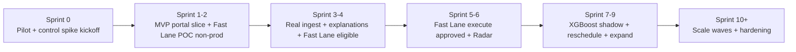

# Batch Orchestration Enhancement — Book of Work

**Document version:** 4.0  
**Status:** Draft — agile backlog (control-early; pluggable hexagonal architecture v3.0)  
**Architecture:** [batch-orchestration-architecture.md](./batch-orchestration-architecture.md)  
**Program:** Batch Intelligence & Control Plane (BICP) / Managed Flow SLA

> **v4.0 alignment with architecture v3.0:** Backend = **Beacon Core** (read-only brain: Ingest, Graph, Registry, Predict, Policy) + **Beacon Control** (only writer: Fast Lane, Actions) + a **pluggable out-of-process adapter layer** (MWAA/Nebula/Databricks first). Fast Lane is sequenced **early** (a thin slice of the full control loop), not deferred. Themes below name Beacon modules; they live inside Core/Control.

---

## How to read this document

This is an **agile backlog**, not a waterfall phase plan. Work is organized as:

1. **MVP** — smallest end-to-end slice that replaces manual Excel for a pilot cohort  
2. **Themes** — epics grouped by capability, prioritized within the backlog  
3. **Sprints** — suggested 2-week iterations; reorder based on velocity and blockers  
4. **Spikes** — timeboxed discovery (days, not months) run **in parallel** with delivery  

Each epic includes **owner**, **priority**, **size**, **dependencies**, and **acceptance criteria** for Jira mapping.

**Detailed design & implementation:** [batch-orchestration-implementation-plan.md](./batch-orchestration-implementation-plan.md) (schemas, APIs, per-story tasks, testing).

**Key stakeholders**

| Area | Responsibility |
|------|----------------|
| **SLA Predictor / ML** | XGBoost SLA Predictor POC, model features, shadow/prod promotion |
| **Ops Portal team** | Ops Portal Radar, Daily Guard, peer solution landscape |
| **SRE ops contact** | Manual process, rainy-day playbooks, UAT |
| **Compute profiling** | Compute index, compute-bound classification |
| **Platform lead** | MWAA + Nebula RDS adapters, ingestion, Fast Lane execution |

---

## Delivery approach — agile, not waterfall

### What changed from v2.0

| Waterfall (v2.0) | Agile (v3.0) |
|------------------|--------------|
| 5 weeks discovery before build (P0) | **Sprint 0** timebox: 1 week, parallel spikes |
| 9 weeks before portal MVP (P1) | **Sprint 1–2**: thin vertical slice in portal |
| Phase exit gates block next phase | **Every sprint** ships demoable increment |
| ~2000 jobs in scope upfront | **10 functions** first → expand each sprint |
| ML before value | **Rules first**; XGBoost shadows in parallel |

### Principles

1. **Vertical slices** — Each sprint delivers user-visible value (portal row, alert, or action), not “backend only.”
2. **Working software over comprehensive docs** — Catalog and integration spec grow with the pilot; don’t block Sprint 1 on 95% coverage.
3. **Pilot-first** — One business domain, **~10 functions** for MVP; add 20–50 per wave after Excel is retired for pilot.
4. **Parallel tracks** — Portal, platform/Beacon, and ML advance concurrently with agreed API contracts (mocks OK).
5. **Inspect and adapt** — Sprint review with SRE + Ops Portal team; reprioritize backlog every 2 weeks.

### Ceremonies (suggested)

| Ceremony | Cadence | Participants |
|----------|---------|--------------|
| Sprint planning | Every 2 weeks | Platform, portal, ML, SRE PO |
| Daily standup | Daily | Delivery team |
| Sprint review / demo | End of sprint | + Ops Portal team, SRE ops contact, MIS pilot user |
| Backlog refinement | Mid-sprint | PO + tech leads |
| Steering sync | Monthly | Leadership, baseline KPI check |

### Definition of Done (increment)

- [ ] Deployed to non-prod; demoed in Sprint review  
- [ ] Acceptance criteria met for the epic/story  
- [ ] Pilot cohort can use the feature OR explicit spike outcome documented  
- [ ] No regression to existing Radar / Daily Guard behavior  

---

## North star & MVP

### North star (6-month direction)

Replace Excel → Teams as the SLA status source of truth for all SLA-bound functions; run the full **control loop** (predict → evaluate → recommend → act with approval) with Fast Lane and audit for SRE — on a pluggable, platform-agnostic core.

### MVP — “First signal in the portal” (target: Sprint 2)

**User story:** As an SRE or MIS user in the pilot domain, I open Daily Guard and see **predicted finish** and **SLA status** for ~10 functions without opening Excel.

| In MVP | Out of MVP (backlog) |
|--------|----------------------|
| ~10 pilot functions | Full 2000-function catalog |
| Rules-based prediction (p50) | XGBoost in production |
| Daily Guard columns: predicted finish, SLA chip | Full Radar D3 overlays |
| Mock or thin ingest via MWAA + Nebula adapters | Full Databricks join, file landing |
| Read-only portal | Prod Fast Lane execution (R3) |
| Optional Teams digest (1 channel) | Leadership analytics |
| Spike: canonical `mf-sla v1` schema v0 | Peer integrations |
| **Control track kickoff:** write-back change-mgmt + `ComputeControl` spike | — |

**MVP exit criterion:** SRE ops contact confirms **no Excel post required** for pilot domain status for 5 consecutive business days.

### Control loop is sequenced early (not deferred)

Because control is a committed deliverable, the **control track runs in parallel from Sprint 0** and surfaces in early releases:

- **Sprint 0:** start write-back change-management (MWAA/Nebula) and the `ComputeControl` (Fast Lane) spike — the long pole.
- **R1:** non-prod Fast Lane POC — reassign one run to a higher capacity tier, then tear down.
- **R2:** portal shows **Fast Lane eligible** (read-only recommendation) once prediction + compute index land.
- **R3:** **headline control increment** — Fast Lane execute button: SRE-approved, single/few functions, audited, reversible, auto tear-down.
- **Graceful degrade:** if change-management slips, R3 stays "recommend only" (SRE executes manually) without blocking visibility value.

---

## Release roadmap (thin releases)

Releases are **outcomes**, not phase gates. Dates are illustrative from program start.



| Release | Sprints | Outcome | Primary metric |
|---------|---------|---------|----------------|
| **R0** | 0 | Pilot cohort named; `mf-sla v1` stub; Ops Portal walkthrough; **write-back change-mgmt + ComputeControl spike started** | 10 functions with owner + SLA |
| **R1** | 1–2 | Daily Guard shows prediction + SLA chip; **non-prod Fast Lane POC** (reassign one run, tear down) | Demo to SRE; MVP criteria + POC logged |
| **R2** | 3–4 | Live MWAA + Nebula ingest; AtRisk + explanations; Teams digest; **Fast Lane eligibility shown (recommend-only)** | ≥90% pilot runs in store <5 min |
| **R3** | 5–6 | **Fast Lane execute button (SRE-approved, audited, reversible)**; Radar AtRisk styling; pilot → ~50 functions | ≥5 approved Fast Lane executions logged |
| **R4** | 7–9 | XGBoost shadow; reschedule actions; compute index v1; expand | Model shadow accuracy; reschedule wins |
| **R5** | 10+ | Rollout waves; model ops; HA; self-service registry; 2nd-adapter readiness | SLA adherence trend vs baseline |

---

## Suggested sprint plan (first 6 sprints)

Use as a **starting point** — swap stories if Ops Portal or MWAA/Nebula RDS access blocks.

### Sprint 0 — Align & slice (1 week)

**Goal:** Pick pilot, stub contracts, no production code required.

| Story | Owner | Size |
|-------|-------|------|
| Name **10 pilot functions** with SLA, owner, Daily Guard IDs (subset of full catalog); include **1–2 compute-bound Fast Lane candidates** | Platform lead + SRE | S |
| Ops Portal walkthrough: Daily Guard extension point + deploy path | Portal | S |
| SLA Predictor POC: features + export sample predictions for stub API | ML | S |
| Agree **`mf-sla v1` stub**: `GET /predictions/{runId}`, `GET /functions`, `GET /fast-lane/eligibility/{runId}` | Platform + Portal | S |
| Spike: MWAA read adapter + Nebula job lookup for 2 pilot functions (Producer SPI) | Platform | S |
| **Control spike (long pole):** start MWAA/Nebula write-back change-management + Databricks `ComputeControl` reassignment feasibility | Platform + SRE | M |

### Sprint 1 — Portal slice (stub backend)

**Goal:** Daily Guard renders predicted finish + SLA chip from mock BFF.

| Story | Owner | Size |
|-------|-------|------|
| BFF calls mock Beacon Core predict responses | Portal | M |
| Daily Guard: **predicted finish (p50)** column | Portal | M |
| Daily Guard: **SLA chip** (OnTrack / AtRisk / Breached) | Portal | S |
| Seed Registry dev DB for 10 pilot functions | Platform | S |
| Rules engine v0 offline script → JSON files for mock | Platform | M |
| **Control track:** non-prod **Fast Lane POC** — `ComputeControl.reassign` one Databricks run to higher tier, then `release` | Platform | M |

### Sprint 2 — MVP demo (rules + thin ingest)

**Goal:** Meet MVP exit criterion with live MWAA + Nebula RDS data for pilot.

| Story | Owner | Size |
|-------|-------|------|
| Beacon Core Ingest v0: MWAA + Nebula adapters → canonical JobRun store (pilot only) | Platform | L |
| Beacon Core Predict v1: rules `predicted_finish`, `sla_status` | Platform | L |
| Wire BFF to real `mf-sla v1` API | Portal | M |
| Compute index v0 for the Fast Lane candidate functions | Platform | S |
| SRE UAT: compare 10 functions vs manual Excel | SRE PO | S |
| **Sprint review:** MIS pilot user invited | All | — |

### Sprint 3 — Explain & alert

**Goal:** AtRisk rows show *why*; Teams optional digest.

| Story | Owner | Size |
|-------|-------|------|
| Explanation JSON (≥2 factors on AtRisk, derived from unmet dependencies) | Platform | M |
| Drill-down in Daily Guard | Portal | M |
| Beacon Notify: pilot Teams digest + AtRisk webhook | Platform | M |
| **Fast Lane eligibility (recommend-only):** Policy gate + `GET /fast-lane/eligibility`; portal badge | Platform + Portal | M |
| Shadow SRE 1 day: measure time saved vs Excel | SRE PO | S |

### Sprint 4 — Graph & file delay

**Goal:** Upstream cascade and file delay in explanations.

| Story | Owner | Size |
|-------|-------|------|
| Dependency edges for pilot (catalog + sensors) | Platform | M |
| Beacon Graph API v0 | Platform | M |
| Cascade Δ in rules | Platform | M |
| Top file patterns for pilot (expected arrival) | Platform + SRE | M |

### Sprint 5 — Radar & expand

**Goal:** Radar overlays; grow pilot to ~50 functions.

| Story | Owner | Size |
|-------|-------|------|
| Radar: AtRisk node styling + tooltip | Portal | L |
| Batch SLA Board page (read-only, filter by owner) | Portal | M |
| Expand ingest + registry to ~50 functions | Platform | M |
| **Fast Lane execute (headline control increment):** Beacon Control `ComputeControl.reassign` for approved run; SRE approval + audit + auto `release`; reversible | Platform + SRE | L |
| Baseline KPI snapshot (90-day SLA % for pilot) | Platform + SRE | S |

### Sprint 6 — Harden control + retire Excel

**Goal:** Harden Fast Lane execution; retire Excel formally; start ML shadow.

| Story | Owner | Size |
|-------|-------|------|
| Feature flag: disable Excel workflow for pilot domain | SRE PO | S |
| Performance: pilot list refresh <10s | Portal | M |
| Fast Lane hardening: cost guardrail, failure/rollback paths, audit review | Platform + SRE | M |
| Start XGBoost shadow pipeline (offline, behind `modelVersion`) | ML | L |
| Backlog refinement for Sprints 7–9 (reschedule actions, expand) | PO | S |

---

## Backlog by theme

Priority: **M** = MVP / next 2 sprints · **H** = high · **L** = later · **S** = spike  

Size: **S** small (~1–3 days) · **M** medium (~1 sprint) · **L** large (multi-sprint epic)

---

### Theme A — Discovery & catalog (continuous, not a gate)

Run these as **ongoing** work; only spike depth needed before Sprint 2.

#### A-1 — Function & job catalog

| Field | Detail |
|-------|--------|
| **Priority** | M (start Sprint 0; expand each sprint) |
| **Size** | L (incremental) |
| **Owner** | Platform lead |
| **Partners** | SRE ops contact |

**Stories**

1. Sprint 0: document 10 pilot functions (full row: SLA, owner, core/need jobs).
2. Each wave: add 20–50 functions to catalog before expanding ingest.
3. Top 50 SLA-critical: dependency edges documented.

**Acceptance criteria**

- [ ] Pilot catalog complete Sprint 0  
- [ ] Catalog grows with each rollout wave (no “95% before any build” gate)  
- [ ] Each onboarded function has owner + consumer list  

---

#### A-2 — Manual SRE baseline KPIs

| Field | Detail |
|-------|--------|
| **Priority** | M |
| **Size** | M |
| **Owner** | Platform lead |
| **Partners** | SRE ops contact |

**Stories**

1. Sprint 0: 1-day shadow SRE → process map draft.  
2. Sprint 2: measure hours/week on Excel for pilot domain.  
3. Sprint 5: 90-day SLA adherence for pilot functions.

**Acceptance criteria**

- [ ] Baseline hours and SLA % published by Sprint 5  
- [ ] Delay taxonomy draft used in explanation enums  

---

#### A-3 — Telemetry & integration spec

| Field | Detail |
|-------|--------|
| **Priority** | M |
| **Size** | M (iterative) |
| **Owner** | Platform lead |

**Stories**

1. Sprint 0 spike: MWAA REST (V1) + Nebula RDS read for pilot.  
2. Sprint 2: JobRun schema v0 + mapping.  
3. Before Fast Lane: write API inventory + change management.  
4. Incremental: DBX join, file landing events.

**Acceptance criteria**

- [ ] JobRun schema v0 before Sprint 2 ingest  
- [ ] Gap list updated each sprint; no blocking “complete spec” gate  

---

#### A-4 — Peer solution landscape

| Field | Detail |
|-------|--------|
| **Priority** | L |
| **Size** | S |
| **Owner** | Platform lead |
| **Partners** | Ops Portal team |

**Stories**

1. Timebox 2 days with the Ops Portal team: 4 peer tools → integrate / extend / out of scope.

**Acceptance criteria**

- [ ] Decision log before Sprint 6 steering (not before MVP)  

---

#### A-5 — XGBoost POC handoff

| Field | Detail |
|-------|--------|
| **Priority** | H (parallel; not blocking MVP) |
| **Size** | M |
| **Owner** | ML engineer |
| **Partners** | SLA Predictor / ML |

**Stories**

1. Sprint 0: feature list + sample export for stubs.  
2. Sprint 6+: shadow pipeline vs rules.

**Acceptance criteria**

- [ ] Features mapped to JobRun schema Sprint 0  
- [ ] Shadow mode before production toggle  

---

### Theme B — Beacon Core & Control (build in thin slices)

Epics B-1–B-6 are **Beacon Core** modules (read-only); B-7–B-9 are **Beacon Control** (the only writer). Platform-specific reads/writes are isolated in **out-of-process adapters**.

#### B-1 — Beacon Registry

| Field | Detail |
|-------|--------|
| **Priority** | M |
| **Size** | M |
| **Owner** | Platform lead |
| **Dependencies** | A-1 pilot list |

**Stories**

1. Schema: `function_id`, `sla_deadline_local`, `timezone`, `owner`, `tier`, `criticality`.  
2. Seed pilot Sprint 0; expand with each wave.

**Acceptance criteria**

- [ ] Dev registry with pilot data Sprint 1  
- [ ] Criticality editable in portal (Theme C, Sprint 7+)  

---

#### B-2 — Beacon Ingest

| Field | Detail |
|-------|--------|
| **Priority** | M |
| **Size** | L |
| **Owner** | Platform engineer |
| **Dependencies** | A-3 JobRun v0 |

**Stories**

1. **v0 (Sprint 2):** MWAA task states + Nebula RDS metadata → JobRun for pilot only.  
2. **v1 (Sprint 4–5):** DBX join, data quality checks.  
3. **v2 (Sprint 5+):** File landing consumer.

**Acceptance criteria**

- [ ] v0: ≥99% pilot runs in store within 5 min  
- [ ] v1: join rate documented with failure handling  

---

#### B-3 — Beacon Graph

| Field | Detail |
|-------|--------|
| **Priority** | H |
| **Size** | M |
| **Owner** | Platform engineer |
| **Dependencies** | A-1 dependencies for pilot |

**Stories**

1. Sprint 4: edges + `GET /functions/{id}/runs/{runId}/graph`.  
2. Critical path for SLA-bound need job.

**Acceptance criteria**

- [ ] Graph API for 100% of pilot functions  
- [ ] Blocked reason enum matches architecture  

---

#### B-4 — Beacon Predict (rules → ML)

| Field | Detail |
|-------|--------|
| **Priority** | M |
| **Size** | L |
| **Owner** | Platform engineer |
| **Partners** | SLA Predictor / ML |

**Stories**

1. **v1 (Sprint 2):** rules p50, `sla_status`, API.  
2. **v1.1 (Sprint 3–4):** explanations, cascade, file delay.  
3. **v2 (Sprint 7+):** XGBoost shadow → prod with rules fallback.

**Acceptance criteria**

- [ ] MVP: every pilot row has predicted finish + chip  
- [ ] AtRisk: ≥2 explanation factors  
- [ ] ML: shadow report before prod toggle  

---

#### B-5 — Beacon Policy

| Field | Detail |
|-------|--------|
| **Priority** | H |
| **Size** | M |
| **Owner** | Platform engineer |

**Stories**

1. Sprint 3: OnTrack / AtRisk / Breached thresholds.  
2. Sprint 3: Fast Lane eligibility rules (with B-7), recommend-only.

**Acceptance criteria**

- [ ] Status matches SRE judgment on sample of 20 runs (Sprint 3 review)  

---

#### B-6 — Beacon Notify

| Field | Detail |
|-------|--------|
| **Priority** | H |
| **Size** | M |
| **Owner** | Platform engineer |

**Stories**

1. Sprint 3: Teams digest + AtRisk webhook (pilot channel, kill switch).

**Acceptance criteria**

- [ ] Digest matches portal at same timestamp  
- [ ] AtRisk alert within 5 min of transition  

---

#### B-7 — Compute index & Fast Lane eligibility

| Field | Detail |
|-------|--------|
| **Priority** | M (control-early) |
| **Size** | M |
| **Owner** | Platform engineer |
| **Partners** | Compute profiling |

**Stories**

1. Sprint 2: compute index v0 for Fast Lane candidate functions.  
2. Sprint 3: eligibility API + portal "eligible / not eligible with reason" (recommend-only).  
3. Sprint 7: compute index v1 (broader coverage).

**Acceptance criteria**

- [ ] Validated on known compute-bound vs I/O-bound sample  

---

#### B-8 — Beacon Control: Fast Lane (`ComputeControl`)

| Field | Detail |
|-------|--------|
| **Priority** | M (control-early headline) |
| **Size** | L |
| **Owner** | Platform engineer (Beacon Control) |
| **Dependencies** | Sprint 0 write-back change-mgmt spike, B-7 |

**Stories**

1. Sprint 1: **non-prod POC** — `ComputeControl.reassign` one run to higher capacity tier, then `release`.  
2. Sprint 5: SRE **Move to Fast Lane** execute button (prod, approved); write adapter performs reassignment; idempotency + audit; reversible.  
3. Auto teardown / restore original capacity tier on completion.

**Acceptance criteria**

- [ ] ≥5 successful approved pilot executions with audit (Sprint 5–6)  
- [ ] SRE approval required; lane visible in portal; capacity tiers opaque to core  

---

#### B-9 — Beacon Control: Actions / reschedule (`OrchestrationControl`)

| Field | Detail |
|-------|--------|
| **Priority** | L |
| **Size** | L |
| **Owner** | Platform engineer (Beacon Control) |

**Stories**

1. Sprint 7+: capability-flagged verbs (trigger, rerun, hold/release, setPriority, reschedule); simulate downstream impact.

**Acceptance criteria**

- [ ] 3 pilot actions with audit + simulation in portal  

---

### Theme C — Ops Portal / SLA Command Center

#### C-1 — Portal integration foundation

| Field | Detail |
|-------|--------|
| **Priority** | M |
| **Size** | M |
| **Owner** | Portal engineer |
| **Partners** | Ops Portal team |

**Stories**

1. Sprint 0: extension points, auth/RBAC, deploy path.  
2. Sprint 1: BFF + mock contract.  
3. SLA Command Center nav entry.

**Acceptance criteria**

- [ ] Ops Portal sign-off on MVP scope Sprint 0  
- [ ] API contract stub agreed Sprint 0  

---

#### C-2 — Daily Guard MVP → full

| Field | Detail |
|-------|--------|
| **Priority** | M |
| **Size** | L |
| **Owner** | Portal engineer |

**Stories**

1. Sprint 1–2: predicted finish, SLA chip.  
2. Sprint 3: explanation drill-down + Fast Lane eligibility badge (recommend-only).  
3. Sprint 5: lane indicator + Fast Lane execute action (approved).  
4. Sprint 9: criticality editor, manual intervention (rainy day).

**Acceptance criteria**

- [ ] MVP exit Sprint 2  
- [ ] MIS confirms Excel replacement Sprint 6  

---

#### C-3 — Radar enhancements

| Field | Detail |
|-------|--------|
| **Priority** | H |
| **Size** | M |
| **Owner** | Portal engineer |
| **Partners** | Ops Portal team |

**Stories**

1. Sprint 5: AtRisk styling, tooltip, Fast Lane badge + execute action (B-8).

**Acceptance criteria**

- [ ] No regression to existing Radar behavior  
- [ ] Ops Portal review before prod deploy  

---

#### C-4 — Batch SLA Board & analytics

| Field | Detail |
|-------|--------|
| **Priority** | L |
| **Size** | M |
| **Owner** | Portal / Platform |

**Stories**

1. Sprint 5: read-only board (tier, owner, subscriptions).  
2. Sprint 10+: weekly leadership SLA report.

---

### Theme D — Scale & hardening (pull when ready)

| ID | Epic | Priority | Owner | Trigger |
|----|------|----------|-------|---------|
| D-1 | Rollout waves (~50 → 500 → 2000) | H | Platform lead | After Sprint 6 MVP sign-off |
| D-2 | Fast Lane recommendation engine (agent-assisted) | L | Platform | After B-8 stable |
| D-3 | Beacon Model Ops (drift, retrain) | H | ML engineer | After ML prod toggle |
| D-4 | Consumer integrations (alerting/BI beyond portal) | L | Platform + Portal | Per A-4 decisions |
| D-5 | Policy auto-remediation tier-2 | L | Platform + SRE PO | Explicit policy approval |
| D-6 | Platform HA / DR | L | Platform | Before wide rollout |
| D-7 | Self-service registry | L | Platform + owners | After D-1 wave 2 |
| D-8 | Chaos drills | L | SRE + Platform | Annual / pre major release |
| D-9 | **2nd adapter bundle** (e.g. Control-M/AutoSys + Snowflake/EMR) | L | Platform | When a second adopter is real |

---

## Team & capacity

Capacity assumes **2-week sprints**. Adjust story pull per velocity.

| Role | Allocation | Focus |
|------|------------|-------|
| Platform engineer | 2 FTE | B-* epics, ingest, predict, Fast Lane |
| Portal engineer | 1 FTE | C-* epics, Ops Portal coordination |
| ML engineer | 0.5–1 FTE | A-5, B-4 v2, D-3 (ramps Sprint 6+) |
| SRE product owner | 0.5 FTE | UAT, acceptance, rainy-day rules |

**Parallel example (Sprint 2):** Platform builds ingest + predict; Portal wires API; ML documents features; SRE runs UAT — no serial phase wait.

---

## Jira structure (suggested)

```
Initiative: BICP / Managed Flow SLA
├── Theme A: Discovery & catalog
├── Theme B: Beacon platform
├── Theme C: Ops Portal
├── Theme D: Scale & hardening
└── Sprint goals (fix version or sprint name)
```

**Labels:** `mvp`, `pilot`, `spike`, `fast-lane`, `ml-shadow`  

**Ticket rule:** Committer owns Jira ticket (per Claude instruction workflow).

**Mapping from v2.0:** P0-* → Theme A spikes · P1-* → Themes B/C MVP · P2-* → B-7–B-9, C-2 · P3/P4 → Theme D

---

## Risk register (agile mitigations)

| Risk | Mitigation | When |
|------|------------|------|
| Radar extension blocked | Sprint 0 Ops Portal walkthrough; stub UI first | Sprint 0 |
| MWAA/Nebula write path restricted (control long pole) | Change-mgmt spike **starts Sprint 0**; if it slips, Fast Lane degrades to recommend-only (no MVP block) | Sprint 0+ |
| Airflow V1/V2 split | Ingest pilot on V1; document V2 batch types | Sprint 0 |
| POC doesn't beat rules | Ship rules-only; extend shadow | Sprint 7+ |
| Over-scoping Sprint 1 | Enforce MVP table; defer Radar to Sprint 5 | Every planning |
| Catalog paralysis | 10 functions only until MVP met | Sprint 0–6 |
| Fast Lane prod write-back risk | Non-prod POC first; SRE approval; audit; reversible; auto tear-down; cost ceiling | Sprint 1, 5 |

---

## Metrics per release

Track every sprint review; compare to baseline from A-2.

| Metric | MVP target (R1–R2) | Control target (R3) |
|--------|-------------------|---------------------|
| SRE hours/week on Excel (pilot) | −50% | −80% |
| Pilot functions with live prediction | 10 | 50+ |
| Mean time to detect AtRisk | <30 min | <5 min |
| Fast Lane: non-prod POC → approved executions | POC logged (R1) | ≥5 executions |
| MIS self-service (portal vs Teams) | 1 domain | 3+ domains |

---

## References

- [Architecture](./batch-orchestration-architecture.md)
- [Implementation plan](./batch-orchestration-implementation-plan.md)
- [Presentation outline](./batch-orchestration-presentation-outline.md)
- [CONTEXT.md](./CONTEXT.md)
