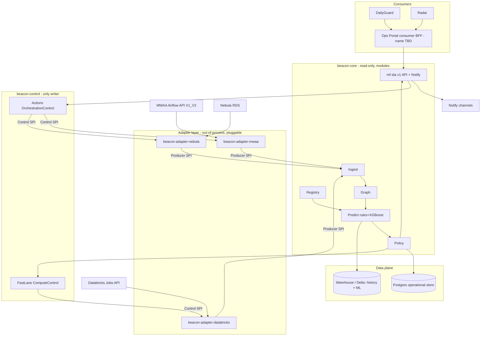
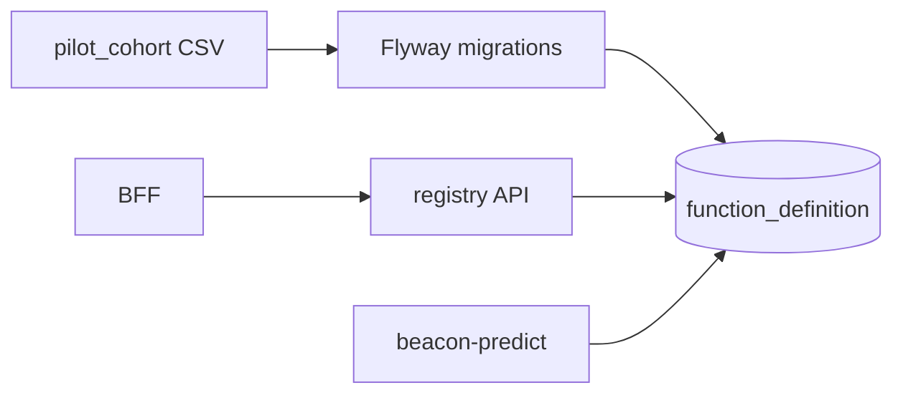
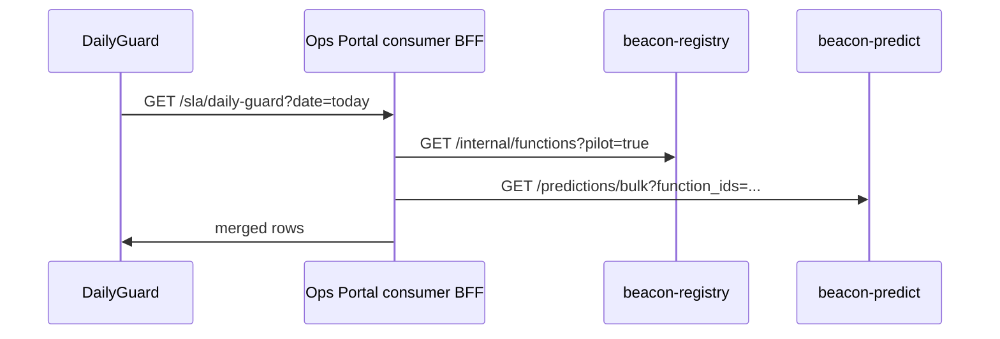
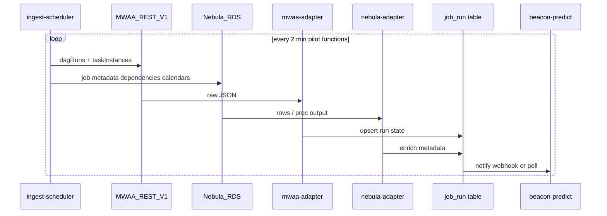
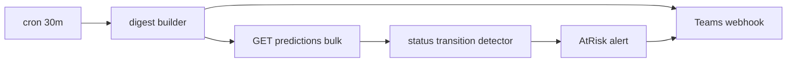
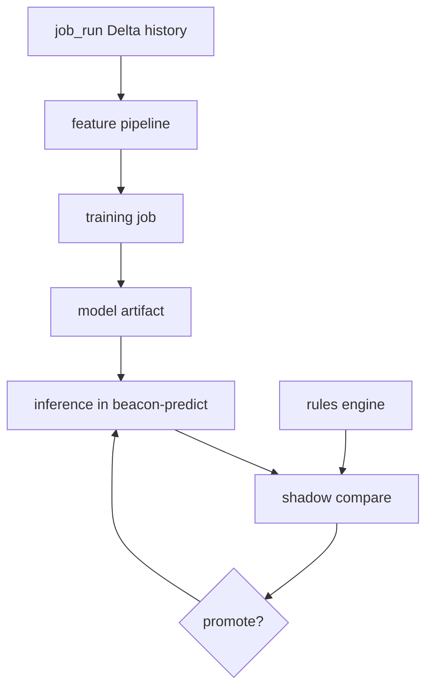

# BICP — Epic Design & Implementation Plan

**Document version:** 2.0  
**Status:** Draft — engineering handoff (aligned to architecture v3.0: pluggable hexagonal control plane)  
**Companion docs:** [Architecture](./batch-orchestration-architecture.md) · [Book of Work](./batch-orchestration-book-of-work.md) · [CONTEXT](./CONTEXT.md)

> **Architecture alignment (v2.0):** The backend is **Beacon Core** (read-only) + **Beacon Control** (only writer) + a **pluggable, out-of-process adapter layer**. The core depends only on the canonical **`mf-sla v1`** contract and on **ports** (Producer / Control / Consumer SPIs) — see architecture §4 and §6, which are **authoritative** for the contract and ports. MWAA/Nebula/Databricks are the first adapter bundle. The per-epic designs below are **Core/Control internal modules**.

---

## 1. Purpose

This document **fleshes out epics and stories** from the agile backlog with:

- **Design** — data models, APIs, component boundaries, sequence flows  
- **Implementation plan** — repos, modules, tasks, testing, rollout  

Use it for sprint planning, Jira story breakdown, and Claude Code instruction branches.

**Platform context:** **Databricks** = compute backend · **MWAA** = orchestration (Airflow **V1** majority, **V2** subset) · **Nebula RDS** = proprietary DB with most orchestration definitions; MWAA core scheduler calls Nebula **stored procedures** for job information at trigger time. See architecture §3.1.

---

## 2. Cross-cutting implementation architecture

### 2.1 Suggested service topology



### 2.2 Repository layout (suggested)

| Repo | Contents | Owner |
|------|----------|-------|
| `mf-sla-contract` | Canonical `mf-sla v1` types + port/SPI definitions (the product surface; see architecture §6) | Platform |
| `beacon-core` | Read-only brain: Registry, Ingest, Graph, Predict (rules+XGBoost), Policy, `mf-sla v1` API, Notify | Platform + ML |
| `beacon-control` | Only writer: Fast Lane (`ComputeControl`), Actions (`OrchestrationControl`); validate/simulate/execute/audit | Platform |
| `beacon-adapter-mwaa` | Out-of-process adapter: Airflow REST (V1 primary; V2 subset) — Producer + Orchestration Control | Platform |
| `beacon-adapter-nebula` | Out-of-process adapter: Nebula RDS read; approved stored-proc write-back | Platform |
| `beacon-adapter-databricks` | Out-of-process adapter: Databricks Jobs API; `ComputeControl` capacity reassignment | Platform |
| _Consumer surface (not a Beacon repo)_ | Predicted finish, AtRisk, at-risk queue, Fast Lane/reschedule actions over `mf-sla v1`. Ships as a **module inside the existing Ops Portal repo** (alongside Radar/Daily Guard), including its portal-facing BFF aggregation. **Module name TBD.** | Portal |

**Adapter contract:** adapters are **separate deployables** communicating with the core over the network SPI (gRPC/REST + events) and publish an `AdapterManifest` (ports, push/poll, supported control verbs). They may be written in any language.

**MVP shortcut:** `beacon-core` ships as one deployable (modules internal); `beacon-control` can start folded into core behind a feature flag but keep the write ports isolated; stub Graph until Sprint 4. Reference adapters first: MWAA + Nebula + Databricks.

### 2.2.1 Repository setup on Bitbucket

The 6 Beacon repos above live in the team's **existing Bitbucket Project** — we do **not** create a separate Project for this program.

Bitbucket's hierarchy is **Workspace → Project → Repository**. A repository belongs to exactly **one** Project, and Projects **cannot be nested**. So inside a single existing Project the only way to "group" the repos is a **shared naming convention**: the `beacon-*` and `mf-sla-*` prefixes make them sort and filter as one block in the Project's repo list.

| Concern | Decision |
|---------|----------|
| Where the repos live | The existing shared Bitbucket Project (alongside unrelated repos); no new/standalone Project |
| Grouping mechanism | Naming prefix only (`beacon-*`, `mf-sla-*`); use Project repo search/filter on the prefix to view just these |
| Consumer surface | A module inside the existing **Ops Portal** repo — not a Beacon repo (see §2.2) |
| This documentation repo | Separate; holds only the docs and detailed plan, no application code |

> No bootstrap scripts, manifest, umbrella repo, or submodules are kept in this docs repo — repo creation and grouping happen directly in Bitbucket.

### 2.3 Technology choices (suggested, not mandated)

| Layer | Choice | Rationale |
|-------|--------|-----------|
| Beacon services | Python 3.11 + FastAPI | Aligns with Airflow/ML ecosystem |
| Operational store | PostgreSQL | Low-latency reads for portal BFF |
| Analytics / features | Delta Lake on Databricks | JobRun history, ML training, KPI reports |
| Ingest trigger | Poll MWAA REST + Nebula RDS (MVP) → event bus later | Matches scheduler + stored-proc model |
| Auth | Ops Portal SSO / JWT passthrough | Reuse the Ops Portal RBAC |
| API contract | OpenAPI 3.1 at `/mf-sla/v1` | Architecture §6.4 |

### 2.4 Shared data contracts

#### JobRun (operational store)

```sql
CREATE TABLE job_run (
  run_id            TEXT NOT NULL,
  function_id       TEXT NOT NULL,
  job_id            TEXT NOT NULL,
  logical_date      DATE NOT NULL,
  scheduled_start   TIMESTAMPTZ,
  actual_start      TIMESTAMPTZ,
  actual_end        TIMESTAMPTZ,
  orchestration_state TEXT NOT NULL,  -- queued|running|success|failed|upstream_failed
  cluster_id        TEXT,
  cluster_sku       TEXT,
  pool              TEXT,
  blocked_by_job_id TEXT,
  blocked_reason    TEXT,             -- file|upstream|cluster|sensor|none
  nebula_function_id TEXT,
  mwaa_dag_id       TEXT NOT NULL,
  airflow_version   TEXT NOT NULL DEFAULT 'v1',  -- v1|v2
  mwaa_task_id      TEXT,
  updated_at        TIMESTAMPTZ NOT NULL DEFAULT now(),
  PRIMARY KEY (function_id, run_id, job_id)
);
CREATE INDEX idx_job_run_function_date ON job_run (function_id, logical_date DESC);
```

#### FunctionDefinition (Beacon Registry)

```sql
CREATE TABLE function_definition (
  function_id           TEXT PRIMARY KEY,
  display_name          TEXT NOT NULL,
  sla_deadline_local    TIME NOT NULL,       -- e.g. 08:00
  timezone              TEXT NOT NULL,       -- e.g. America/New_York
  owner_email           TEXT NOT NULL,
  tier                  SMALLINT NOT NULL DEFAULT 2,
  criticality           SMALLINT NOT NULL DEFAULT 2,
  fast_lane_policy      JSONB DEFAULT '{}',
  nebula_function_id  TEXT NOT NULL,
  mwaa_dag_ids        TEXT[] NOT NULL,
  airflow_version     TEXT NOT NULL DEFAULT 'v1',
  pilot_cohort          BOOLEAN DEFAULT false,
  created_at            TIMESTAMPTZ NOT NULL DEFAULT now(),
  updated_at            TIMESTAMPTZ NOT NULL DEFAULT now()
);
```

#### PredictionSnapshot

```sql
CREATE TABLE prediction_snapshot (
  run_id                TEXT NOT NULL,
  function_id           TEXT NOT NULL,
  predicted_start       TIMESTAMPTZ,
  predicted_finish_p50  TIMESTAMPTZ,
  predicted_finish_p90  TIMESTAMPTZ,
  sla_deadline          TIMESTAMPTZ NOT NULL,
  sla_status            TEXT NOT NULL,       -- OnTrack|AtRisk|Breached|Unknown
  confidence            TEXT NOT NULL,
  compute_index         NUMERIC(4,2),
  fast_lane_eligible    BOOLEAN DEFAULT false,
  factors               JSONB NOT NULL DEFAULT '[]',
  model_version         TEXT NOT NULL DEFAULT 'rules-v1',
  created_at            TIMESTAMPTZ NOT NULL DEFAULT now(),
  PRIMARY KEY (function_id, run_id, created_at)
);
CREATE INDEX idx_prediction_latest ON prediction_snapshot (function_id, run_id, created_at DESC);
```

### 2.5 API contract (MVP subset)

OpenAPI stub agreed Sprint 0; full surface in architecture §6.4.

**`GET /mf-sla/v1/functions?pilot=true`**

```json
{
  "items": [
    {
      "function_id": "daily_core",
      "display_name": "Daily Core",
      "sla_deadline_local": "08:00",
      "timezone": "America/New_York",
      "latest_run_id": "2026-06-13T00:00:00+00:00",
      "sla_status": "AtRisk",
      "predicted_finish_p50": "2026-06-13T07:45:00Z"
    }
  ]
}
```

**`GET /mf-sla/v1/predictions/{runId}?function_id=daily_core`**

Returns architecture §5.5 explanation payload.

---

## 3. Epic index

| Epic ID | Title | Sprint | Book of Work |
|---------|-------|--------|--------------|
| E-00 | Sprint 0 alignment | 0 | Sprint 0 stories |
| E-01 | Beacon Registry | 0–1 | B-1 |
| E-02 | Portal foundation & BFF | 0–1 | C-1 |
| E-03 | Daily Guard MVP columns | 1–2 | C-2 |
| E-04 | Beacon Ingest v0 | 2 | B-2 |
| E-05 | Beacon Predict rules v1 | 2 | B-4, B-5 |
| E-06 | Explanations & drill-down | 3 | B-4 v1.1 |
| E-07 | Beacon Notify | 3 | B-6 |
| E-08 | Beacon Graph & file delay | 4 | B-3 |
| E-09 | Radar overlays & SLA Board | 5 | C-3, C-4 |
| E-10 | MVP hardening & scale prep | 6 | Theme D prep |
| E-11 | XGBoost shadow → prod | 7–8 | B-4 v2, A-5 |
| E-12 | Fast Lane MVP | 8–9 | B-7, B-8, C-2 |

---

## E-00 — Sprint 0 alignment

**Outcome:** 10 pilot functions named; OpenAPI stub; Ops Portal extension points documented.

### Stories

#### E-00-S1 — Pilot cohort selection

| | |
|--|--|
| **As** | Platform lead |
| **I want** | 10 functions with SLA, owners, Nebula function IDs, and MWAA DAG mapping |
| **So that** | Every subsequent epic has a fixed integration scope |

**Design**

- Spreadsheet or `function_definition` seed CSV: `function_id`, `nebula_function_id`, `display_name`, `sla_deadline_local`, `timezone`, `owner_email`, `mwaa_dag_ids[]`, `airflow_version`, `daily_guard_parent_id`.
- Selection criteria: one business domain, mix of OnTrack and historically late functions, Ops Portal team confirms Daily Guard visibility.

**Implementation**

1. Export Daily Guard parent list from Ops Portal (or SRE export).
2. Join with MWAA DAG list and Nebula RDS function table for same names/IDs.
3. SRE workshop (2hr): validate SLA times and Teams consumer list.
4. Commit `seeds/pilot_cohort_v1.csv` to `beacon-registry`.

**DoD:** 10 rows reviewed by SRE ops contact; `pilot_cohort=true` flag set.

---

#### E-00-S2 — OpenAPI stub & mock server

**Design**

- Single `openapi/mf-sla-v1.yaml` with `GET /functions`, `GET /predictions/{runId}`.
- Mock server (Prism or WireMock) returns SLA Predictor POC sample JSON + synthetic AtRisk row.

**Implementation**

1. Platform drafts YAML from §2.5 and architecture §5.5 example.
2. Portal reviews response shapes for Daily Guard columns.
3. Deploy mock to dev URL; BFF points to mock in Sprint 1.

**DoD:** Portal engineer successfully `curl` mock from dev laptop.

---

#### E-00-S3 — Ops Portal extension spike

**Design**

- Document: Daily Guard table component path, feature flag pattern, deploy pipeline, RBAC roles (`sla_read`, `sla_sre`, `sla_admin`).
- Decision: extend Radar/Daily Guard in-place vs add a new SLA module package (name TBD) within the existing Ops Portal repo.

**Implementation**

1. 2hr walkthrough with the Ops Portal team; record extension points in `docs/portal-integration-notes.md` (create during spike).
2. Confirm feature flag name: `sla_command_center_mvp`.
3. Wireframe attach to Jira epic C-1.

**DoD:** Ops Portal team written OK on MVP scope (predicted finish + chip only; no Radar in Sprint 1).

---

#### E-00-S4 — MWAA + Nebula RDS integration spike

**Design**

- **MWAA (V1):** Map `GET /api/v1/dags/{dag_id}/dagRuns` and `.../taskInstances` to JobRun fields.
- **Nebula RDS:** Document tables/views + stored procedure(s) the **core scheduler** calls for job information; read-only replica for ingest.
- Note polling interval, auth, rate limits; flag which pilot DAGs use **Airflow V2**.

**Implementation**

1. Script `scripts/spike_mwaa_export.py` → sample JSON on disk.
2. Script `scripts/spike_nebula_rds_job_lookup.sql` → sample job metadata rows.
3. Gap list: missing `pool`, cluster conf, sensor states, V2 API differences.

**DoD:** Sample JobRun JSON (MWAA + Nebula joined) in `beacon-ingest/fixtures/` for unit tests.

---

## E-01 — Beacon Registry

**Book of Work:** B-1 · **Sprints:** 0–1 · **Owner:** Platform lead

### Epic design

Registry is the **SLA anchor** for prediction and portal. Portal and Predict read; only SRE/admin writes (later via portal).



**Service API (internal)**

| Method | Path | Purpose |
|--------|------|---------|
| GET | `/internal/functions` | List with filters `pilot`, `tier` |
| GET | `/internal/functions/{id}` | Single definition |
| POST | `/internal/functions` | Admin create (post-MVP) |
| PATCH | `/internal/functions/{id}` | Criticality update (Sprint 9) |

### Stories

#### E-01-S1 — Schema migration & seed loader

**Implementation**

1. Add Flyway/Liquibase migrations in `beacon-registry`.
2. CLI: `python -m registry.seed --file seeds/pilot_cohort_v1.csv`.
3. Unit test: 10 functions loaded; SLA timezone parses correctly.

**DoD:** Dev Postgres has seed data; CI migration test passes.

---

#### E-01-S2 — Registry read API

**Implementation**

1. FastAPI router `GET /internal/functions?pilot=true`.
2. Response DTO matches BFF needs (include `latest_run_id` nullable for Sprint 1).
3. Integration test with Testcontainers Postgres.

**DoD:** OpenAPI published; BFF can list pilot functions.

---

#### E-01-S3 — SLA deadline resolver

**Design**

- Utility `resolve_sla_deadline(function_id, logical_date) -> timestamptz` applying timezone + DST.
- Used by Predict and Policy; single implementation avoids drift.

**Implementation**

1. Module `registry/sla_clock.py` with zoneinfo.
2. Tests: spring forward, fall back, cross-midnight batches.

**DoD:** Predict service imports resolver; golden tests for 3 pilot functions.

---

## E-02 — Portal foundation & BFF

**Book of Work:** C-1 · **Sprints:** 0–1 · **Owner:** Portal engineer

### Epic design

BFF **aggregates** Beacon services so Daily Guard makes one round-trip per refresh.



**BFF response row**

```json
{
  "function_id": "daily_core",
  "parent_label": "Daily Core",
  "child_jobs": [{"job_id": "core_1", "state": "running"}],
  "predicted_finish_p50": "2026-06-13T07:45:00Z",
  "predicted_finish_p90": "2026-06-13T08:10:00Z",
  "sla_status": "AtRisk",
  "sla_deadline_display": "08:00 ET",
  "factors_summary": "File delay +22m cascade"
}
```

### Stories

#### E-02-S1 — BFF scaffold & auth

**Implementation**

1. Node/Express or FastAPI BFF with SSO middleware mirroring Ops Portal.
2. Route `GET /sla/daily-guard` proxied to mock in Sprint 1.
3. RBAC: MIS → read pilot; SRE → read all.

**DoD:** Authenticated call from dev portal shell returns mock JSON.

---

#### E-02-S2 — Feature flag & routing

**Implementation**

1. Flag `sla_command_center_mvp` gates new columns.
2. Nav entry "SLA Command Center" → Daily Guard enhanced view (same page, extra columns).

**DoD:** Flag off = unchanged Daily Guard; flag on = new columns visible in dev.

---

## E-03 — Daily Guard MVP columns

**Book of Work:** C-2 (phase 1) · **Sprints:** 1–2 · **Owner:** Portal engineer

### Epic design

**UI components**

| Column | Component | States |
|--------|-----------|--------|
| Predicted finish | `PredictedFinishCell` | p50 time; tooltip p90 |
| SLA status | `SlaStatusChip` | green OnTrack, amber AtRisk, red Breached, gray Unknown |

```text
┌────────────────┬──────────────┬─────────────┬──────────────┐
│ Function       │ Status       │ Pred finish │ SLA          │
├────────────────┼──────────────┼─────────────┼──────────────┤
│ Daily Core     │ Running      │ 07:45 ET    │ [AtRisk]     │
│ Cash Position  │ Success      │ 06:30 ET    │ [OnTrack]    │
└────────────────┴──────────────┴─────────────┴──────────────┘
```

### Stories

#### E-03-S1 — PredictedFinishCell (mock data)

**Implementation**

1. React component; format in user timezone from BFF.
2. Tooltip: "p90: 08:10 ET — tap for details" (drill-down Sprint 3).
3. Storybook stories for each state.

**DoD:** Storybook + integrated behind feature flag with mock BFF.

---

#### E-03-S2 — SlaStatusChip

**Design**

- Color tokens aligned with Radar (coordinate with the Ops Portal team): do not clash with existing status colors.
- `Unknown` when prediction missing or ingest lag > 10 min.

**Implementation**

1. Chip component + aria labels for accessibility.
2. Sort/filter by SLA status (SRE use case).

**DoD:** SRE can sort Daily Guard by AtRisk in dev.

---

#### E-03-S3 — Wire BFF to live Predict API

**Implementation**

1. Replace mock with `beacon-predict` dev URL.
2. Loading skeleton + error banner if predict unavailable (fallback: Unknown chip).
3. Refresh interval 60s (configurable); performance budget <10s initial load.

**DoD:** Sprint 2 demo shows live MWAA + Nebula RDS-backed predictions for 10 functions.

---

## E-04 — Beacon Ingest v0

**Book of Work:** B-2 v0 · **Sprint:** 2 · **Owner:** Platform engineer

### Epic design



**MWAA → JobRun mapping (V1 primary)**

| MWAA field | JobRun column |
|------------|---------------|
| `dag_run.execution_date` | `logical_date`, `run_id` |
| `task_instance.task_id` | `job_id`, `mwaa_task_id` |
| `task_instance.state` | `orchestration_state` |
| `task_instance.start_date` | `actual_start` |
| `task_instance.end_date` | `actual_end` |
| `dag_id` | `mwaa_dag_id`; lookup `function_id` via registry |

**Nebula RDS → JobRun enrichment**

| Nebula source | JobRun column |
|---------------|---------------|
| Function / job tables | `nebula_function_id`, `function_id`, dependency hints |
| Holiday / cron rules | `scheduled_start` adjustments |
| Stored proc output (scheduler) | Authoritative job hierarchy for trigger window |

### Stories

#### E-04-S1 — MWAA + Nebula adapter libraries

**Implementation**

1. `beacon-mwaa-adapter`: `MwaaClient`, `map_task_instance()`, V1/V2 route selection, retries, auth.
2. `beacon-nebula-adapter`: `NebulaRdsClient`, read-only queries + documented stored proc interface for writes.
3. Unit tests with fixtures from E-00-S4.

**DoD:** 95% field mapping coverage on fixture set; V1/V2 batch-type flag documented.

---

#### E-04-S2 — Polling ingest worker

**Implementation**

1. Celery beat or K8s CronJob every 2 minutes: pilot `mwaa_dag_ids` + Nebula function IDs.
2. Join MWAA run state with Nebula metadata on `(function_id, run_id)`.
3. Upsert via `INSERT ... ON CONFLICT DO UPDATE`.
4. Metrics: `ingest_lag_seconds`, `runs_upserted_total`.

**DoD:** ≥99% of pilot task instances in PG within 5 min of MWAA UI showing state.

---

#### E-04-S3 — Ingest → Predict trigger

**Design**

- MVP: Predict polls `job_run` for rows where `updated_at > last_prediction`.
- Later: message bus `job_run.updated` event.

**Implementation**

1. `beacon-predict` scheduler every 1 min for pilot functions.
2. Idempotent: same run_id re-predicts only if inputs changed.

**DoD:** State change in MWAA reflects in new PredictionSnapshot within 3 min end-to-end.

---

## E-05 — Beacon Predict rules v1

**Book of Work:** B-4 v1, B-5 · **Sprint:** 2 · **Owner:** Platform engineer

### Epic design

**Rules pipeline (MVP)**

```text
job_run rows + function_definition
        │
        ▼
┌───────────────────┐
│ predicted_start   │  max(cron, actual_start, now) — simplified MVP
└─────────┬─────────┘
          ▼
┌───────────────────┐
│ runtime lookup    │  historical p50 from Delta table by function+sku+DOW
└─────────┬─────────┘
          ▼
┌───────────────────┐
│ predicted_finish  │  start + p50 runtime (p90 = p50 * 1.15 MVP fudge)
└─────────┬─────────┘
          ▼
┌───────────────────┐
│ sla_status        │  compare p90 to sla_deadline
└─────────┬─────────┘
          ▼
   prediction_snapshot
```

**MVP simplifications (documented tech debt)**

- No cascade or file delay until E-06/E-08.
- Historical runtime: precomputed CSV for pilot if Delta not ready.
- `predicted_start` uses `actual_start` if set, else `scheduled_start`, else `now`.

### Stories

#### E-05-S1 — Runtime statistics table

**Implementation**

1. Delta table `sla.runtime_stats` or Postgres `runtime_stats(function_id, cluster_sku, dow, p50_minutes, p90_minutes)`.
2. Seed from the SLA Predictor POC export or 90-day MWAA/Nebula/Databricks history extract for pilot only.

**DoD:** Lookup returns p50 for 10/10 pilot functions.

---

#### E-05-S2 — Rules engine module

**Implementation**

1. `predict/rules_engine.py`: pure functions, unit-tested.
2. `predict/sla_policy.py`: `evaluate_status(p50, p90, deadline)`.
3. Persist `PredictionSnapshot` on each run.

**DoD:** Golden-file tests: 5 scenarios (OnTrack, AtRisk, Breached, running, missing data).

---

#### E-05-S3 — Public predict API

**Implementation**

1. `GET /mf-sla/v1/predictions/{runId}?function_id=`
2. `GET /mf-sla/v1/predictions/bulk?function_ids=a,b` for BFF.
3. Returns latest snapshot; include `model_version: rules-v1`.

**DoD:** Matches OpenAPI stub; p95 latency <200ms for bulk 10 functions.

---

## E-06 — Explanations & drill-down

**Book of Work:** B-4 v1.1 · **Sprint:** 3 · **Owner:** Platform + Portal

### Epic design

Extend rules engine to emit `factors[]` per architecture §5.5. MVP factor types:

| type | Source |
|------|--------|
| `historical_runtime_p90` | runtime_stats |
| `late_start` | actual_start > scheduled_start + threshold |
| `cluster_queue` | stub or DBX in v1 |

**Portal:** side panel `ExplanationDrawer` on row click.

### Stories

#### E-06-S1 — Factor builders

**Implementation**

1. `predict/factors/late_start.py`, `.../runtime.py`.
2. AtRisk rows must have ≥2 factors (acceptance criteria).

**DoD:** Unit tests per factor; JSON schema validated.

---

#### E-06-S2 — ExplanationDrawer UI

**Implementation**

1. Drawer lists factors human-readable ("Upstream file `daily.csv` expected by 06:00, still absent").
2. Link to Radar node (Sprint 5).

**DoD:** SRE UAT: 8/10 AtRisk samples judged "actionable" vs Excel narrative.

---

## E-07 — Beacon Notify

**Book of Work:** B-6 · **Sprint:** 3 · **Owner:** Platform engineer

### Epic design



### Stories

#### E-07-S1 — Teams digest template

**Implementation**

1. Adaptive Card: function, deadline, predicted finish, status, portal deep link.
2. Config: `PILOT_TEAMS_WEBHOOK_URL`, kill switch env var.

**DoD:** Digest content byte-matches portal export at same timestamp (manual check).

---

#### E-07-S2 — AtRisk transition webhook

**Implementation**

1. Store last `sla_status` per function; on `OnTrack→AtRisk`, POST webhook within 5 min.
2. Debounce duplicate alerts same run.

**DoD:** Simulated transition fires one alert in dev.

---

## E-08 — Beacon Graph & file delay

**Book of Work:** B-3 · **Sprint:** 4 · **Owner:** Platform engineer

### Epic design

**DependencyEdge table**

```sql
CREATE TABLE dependency_edge (
  function_id       TEXT NOT NULL,
  from_job_id       TEXT NOT NULL,
  to_job_id         TEXT NOT NULL,
  edge_type         TEXT NOT NULL,  -- sequential|parallel|file_sensor|upstream_function
  metadata          JSONB,
  PRIMARY KEY (function_id, from_job_id, to_job_id)
);
```

**Graph API:** `GET /mf-sla/v1/functions/{id}/runs/{runId}/graph` → nodes (jobs + states) + edges.

**Cascade rule:** architecture §5.2 — propagate Δ from blocked upstream along critical path.

### Stories

#### E-08-S1 — Load pilot dependency catalog

**Implementation**

1. CSV from A-1 dependency documentation → `dependency_edge` seed.
2. Merge live `blocked_reason` from `job_run`.

**DoD:** Graph API returns edges for 10/10 pilot functions.

---

#### E-08-S2 — Cascade Δ in rules engine

**Implementation**

1. `predict/cascade.py`: BFS critical path; add upstream delay to `predicted_start`.
2. Factor `cascade_delta_minutes` in explanations.

**DoD:** Scenario test: upstream +22m → downstream AtRisk with cascade factor.

---

#### E-08-S3 — File expectation catalog

**Implementation**

1. Table `file_expectation(pattern, expected_p50_arrival, owner)`.
2. Ingest v2: landing-zone listener or batch scan marks file present/absent.
3. Factor `file_delay` when absent past expected time.

**DoD:** Covers files accounting for ≥80% pilot upstream delays (per SRE taxonomy).

---

## E-09 — Radar overlays & SLA Board

**Book of Work:** C-3, C-4 · **Sprint:** 5 · **Owner:** Portal

### Epic design

**Radar node overlay (D3)**

- Existing node color preserved; add **amber/red ring** for AtRisk/Breached.
- Tooltip: predicted finish, top 2 factors, Fast Lane badge (read-only until E-12).

**SLA Board page**

- New Ops Portal route for the SLA board (final path follows the module name, TBD).
- Filters: tier, owner, `sla_status`, subscriptions.
- Read-only for MIS; export CSV optional.

### Stories

#### E-09-S1 — Radar AtRisk styling

**Implementation**

1. Fetch predictions keyed by `function_id` / node id mapping (coordinate with the Ops Portal team on ID join).
2. Performance: batch fetch; do not N+1 per node.

**DoD:** Ops Portal sign-off; no frame rate regression on 200-node graph in perf test.

---

#### E-09-S2 — SLA Board page

**Implementation**

1. Table view reusing BFF bulk endpoint.
2. MIS pilot user walkthrough.

**DoD:** User finds own domain functions without SRE Teams post.

---

#### E-09-S3 — Expand ingest to ~50 functions

**Implementation**

1. Add functions to registry seed wave 2.
2. Ingest worker config-driven DAG list.

**DoD:** Same SLOs as 10-function pilot.

---

## E-10 — MVP hardening & scale prep

**Sprint:** 6 · **Owner:** All

### Stories (summary)

| Story | Design | Implementation |
|-------|--------|----------------|
| Excel retirement flag | SRE playbook update | Feature flag + comms to MIS channel |
| Performance | BFF caching 30s TTL | Redis or in-memory per instance |
| MWAA/Nebula write spike | Document MWAA trigger/pool APIs + Nebula stored procs | ADR for Fast Lane adapter |
| ML shadow kickoff | Shadow table `prediction_shadow` | Batch job compares ML vs rules vs actual |
| KPI baseline | SQL on Delta | Report SRE hours, SLA % for pilot |

**DoD:** 5 consecutive business days no Excel for pilot; steering deck with before/after metrics.

---

## E-11 — XGBoost shadow → production

**Book of Work:** B-4 v2, A-5 · **Sprints:** 7–8 · **Owners:** ML + Platform

### Epic design



**Feature pipeline (from SLA Predictor POC)**

- Slot contention, DOW, cluster SKU, queue depth, upstream delay minutes, historical p90, row volume proxy.
- **Exclude** on-prem historical runtimes per architecture §5.3.

### Stories (summary)

| ID | Implementation |
|----|----------------|
| E-11-S1 | `features/job_run_features.py` — Delta batch + streaming for pilot |
| E-11-S2 | Training notebook → scheduled Databricks job; model registry |
| E-11-S3 | Inference hook in `beacon-predict`; `model_version: xgb-v1` |
| E-11-S4 | Shadow mode: write both rules + ML; no user-facing ML until promotion |
| E-11-S5 | Promotion ADR: MAE improvement, false OnTrack rate guardrail |
| E-11-S6 | Fallback to rules on inference error or low confidence |

**DoD:** Shadow report 4 weeks; prod toggle per function tier with kill switch.

---

## E-12 — Fast Lane MVP

**Book of Work:** B-7, B-8 · **Sprints:** 8–9 · **Owners:** Platform + compute profiling + Portal

### Epic design

Architecture §8.2 flow implemented as state machine:

```text
AtRisk + eligible → PENDING_APPROVAL → APPROVED → REASSIGNING → RUNNING → TEARDOWN → COMPLETE
```

**FastLaneAssignment table**

```sql
CREATE TABLE fast_lane_assignment (
  assignment_id     UUID PRIMARY KEY,
  function_id       TEXT NOT NULL,
  run_id            TEXT NOT NULL,
  from_sku          TEXT NOT NULL,
  to_sku            TEXT NOT NULL,
  compute_index     NUMERIC(4,2) NOT NULL,
  approved_by       TEXT NOT NULL,
  status            TEXT NOT NULL,
  outcome_minutes_saved INT,
  created_at        TIMESTAMPTZ NOT NULL DEFAULT now()
);
```

**Write-back (via adapters)**

1. **MWAA:** PATCH pool / trigger / clear task; cluster conf on Databricks-submit operators.
2. **Nebula RDS:** Invoke approved stored procedure(s) for orchestration rule changes.
3. Idempotency key = `{function_id}:{run_id}:fastlane`.
4. Post-run: restore original conf; audit immutable.

### Stories (summary)

| ID | Design / implementation |
|----|---------------------------|
| E-12-S1 | `compute_index` v1 with compute profiling — batch score existing pilot runs |
| E-12-S2 | `GET /fast-lane/eligibility/{runId}` in beacon-policy |
| E-12-S3 | `POST /fast-lane/assignments` — approval + adapter call |
| E-12-S4 | Portal **Move to Fast Lane** button; disabled + reason when ineligible |
| E-12-S5 | Radar **Fast Lane** badge during assignment |
| E-12-S6 | Teardown job on terminal state; cost guardrail env config |

**DoD:** 5 successful pilot executions with audit; zero unapproved writes.

---

## 4. Testing strategy

| Layer | Approach |
|-------|----------|
| Unit | Rules engine, SLA clock, MWAA + Nebula RDS mapping, factor builders |
| Contract | OpenAPI pact between BFF ↔ predict ↔ registry |
| Integration | Testcontainers Postgres; MWAA + Nebula RDS fixtures |
| E2E | Dev: simulate late file → AtRisk in Daily Guard |
| UAT | SRE compares 10 functions vs Excel each sprint until MVP |
| Performance | BFF bulk 50 functions <10s; predict bulk <500ms p95 |

---

## 5. Rollout & feature flags

| Flag | Purpose | Default |
|------|---------|---------|
| `sla_command_center_mvp` | Daily Guard columns | off |
| `sla_explanations` | Explanation drawer | off |
| `sla_teams_digest` | Teams notifications | off |
| `sla_radar_overlays` | Radar AtRisk styling | off |
| `sla_ml_predictions` | XGBoost prod path | off |
| `sla_fast_lane` | Move to Fast Lane button | off |

Rollout order: dev → SRE UAT → pilot MIS → expand cohort waves.

---

## 6. Jira story template

```markdown
**Epic:** E-05 Beacon Predict rules v1
**Story:** E-05-S2 Rules engine module

**Description**
As beacon-predict, compute predicted_finish and sla_status for pilot JobRuns.

**Design**
[Link to this doc section]

**Tasks**
- [ ] Implement rules_engine.py
- [ ] Implement sla_policy.py
- [ ] Golden-file tests
- [ ] Persist PredictionSnapshot

**DoD**
- [ ] 5 golden scenarios pass
- [ ] API returns model_version rules-v1
```

---

## 7. References

- [Architecture §5 Prediction criteria](./batch-orchestration-architecture.md#5-prediction-criteria)
- [Architecture §6 Data platform](./batch-orchestration-architecture.md#6-data-platform)
- [Architecture §8 Fast Lane](./batch-orchestration-architecture.md#8-fast-lane)
- [Book of Work — sprint plan](./batch-orchestration-book-of-work.md#suggested-sprint-plan-first-6-sprints)
