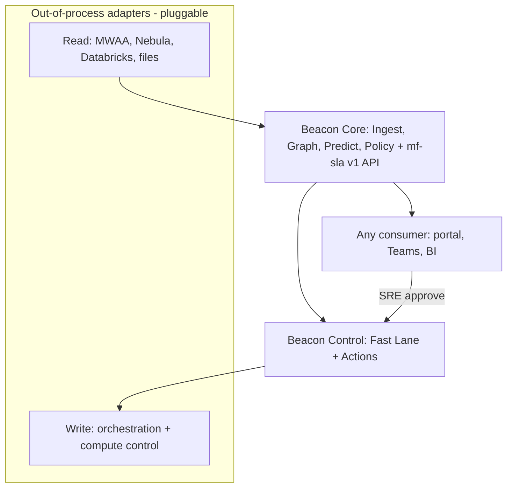

# Batch Orchestration Enhancement — Presentation Outline

**Format:** Mixed audience (executive summary + technical appendix)  
**Total time:** ~30 minutes (15 min executive + 15 min technical)  
**Companion docs:**

- [Architecture](./batch-orchestration-architecture.md)
- [Book of Work](./batch-orchestration-book-of-work.md)

---

## How to use this document

Each slide lists:

- **Title** — slide heading
- **On slide** — bullet points visible to audience
- **Speaker notes** — what to say (problem → solution → metric where applicable)
- **Visual** — diagram or asset suggestion

---

# Part A — Executive summary (~15 minutes)

---

## Slide 1 — Title

**On slide**

- Batch Orchestration Intelligence & Control
- From manual monitoring to predictive SLA management
- [Your org name] | [Date]

**Speaker notes**

- Open with scope: this is about making batch SLAs visible, predictable, and actionable—not replacing MWAA, Nebula RDS, or Databricks.
- Set expectation: first half is outcomes and roadmap; second half is optional technical deep-dive.

**Visual:** Clean title slide; subtle pipeline/orchestration icon.

---

## Slide 2 — The pain today

**On slide**

- Hundreds of Databricks batches across multiple clusters (Databricks = compute backend)
- Batches wait on source files that often arrive late
- SRE manually queries MWAA, Nebula RDS, and Databricks → builds Excel → posts to Teams
- Users lack real-time, self-service SLA visibility
- A finish-time prediction POC exists but is not in production

**Speaker notes**

- **Problem:** SLA misses are discovered late because status is assembled manually.
- **Problem:** When files are delayed, nobody sees a credible "will we make SLA?" answer until SRE investigates.
- **Metric to cite:** SRE hours spent on daily status reporting (baseline from Phase 0).

**Visual:** Sources → MWAA (scheduler) → Nebula RDS (stored proc / job info) → Databricks; side branch SRE → Excel → Teams.

---

## Slide 3 — Vision

**On slide**

- **Predict** — when batches start and finish, with confidence
- **Visualize** — SLA status in the existing Ops portal
- **Act** — Fast Lane + reschedule with SRE approval (sequenced **early**, not later)
- **Pluggable** — platform-agnostic core; our stack is the first adapter, other teams plug in their own

**Speaker notes**

- **Solution:** A platform-agnostic Batch Intelligence & **Control Plane** running one loop: observe → predict → evaluate → recommend → act → show.
- **Solution:** It augments (not replaces) the orchestration stack, and depends only on a canonical contract + ports — MWAA/Nebula/Databricks are the first adapter bundle.
- **Solution:** Same portal users already know; any portal can consume the API.
- **Metric:** Target ≥80% reduction in manual SRE reporting time; ≥5 Fast Lane saves in pilot.

**Visual:** Four pillars icon row: Predict | Visualize | Act | Pluggable.

---

## Slide 4 — Current vs target architecture

**On slide**

- Today: fragmented signals, manual glue, offline POC
- Target: pluggable hexagonal control plane — adapters → core (predict/policy) → any consumer; control via write adapters
- Platforms sit behind **out-of-process adapters**; the core depends only on the `mf-sla v1` contract

**Speaker notes**

- Walk the diagram: read adapters (MWAA, Nebula, Databricks) feed Beacon Core; Core predicts + evaluates; consumers read the API.
- Portal and Teams consume the same API—Excel goes away.
- Beacon Control is the only writer; Fast Lane / reschedule go through write adapters with approval + audit.
- Swap MWAA/Nebula/Databricks for another team's stack by writing adapters — core unchanged.

**Visual:** Use target-state diagram from architecture doc (§4.3).




---

## Slide 4a — Platform stack (how batches run today)

**On slide**

- **Databricks** — compute backend (where jobs run)
- **MWAA** — orchestration engine (Airflow **V1** for most batches; **V2** for a subset)
- **Nebula RDS** — proprietary database; **most orchestration defined here** (rules, calendars, job metadata)
- **Trigger:** MWAA core scheduler → Nebula stored procedure → job info → Databricks

**Speaker notes**

- Clarify common misconception: Nebula is **not** "just Airflow"—it is an RDS layer the scheduler calls into.
- Beacon reads **all three** layers (via adapters) to predict SLA accurately — this is our first adapter bundle, not the whole product.
- BICP does not require Airflow V2 migration for MVP; pilot on V1 first.

**Visual:** Architecture §3.1 sequence diagram (scheduler → Nebula RDS → Databricks).

---

## Slide 5 — What internal users get

**On slide**

- Today's batch board: SLA deadline, predicted finish, status
- Plain-language explanations ("waiting for file X")
- Filters by domain, tier, my batches
- Optional Teams digest and AtRisk alerts—no waiting for Excel

**Speaker notes**

- **Problem:** Users depend on SRE for status updates on a fixed schedule.
- **Solution:** Self-service portal with the same data SRE uses internally.
- **Metric:** Time-to-answer "will my batch make SLA?" drops from hours to minutes.

**Visual:** Mock wireframe—table with green/amber/red status chips.

---

## Slide 6 — What SRE gets

**On slide**

- At-risk queue sorted by time-to-breach
- Explainable ETAs with contributing factors
- What-if reschedule simulation (Phase 2)
- Approved actions with full audit trail

**Speaker notes**

- **Problem:** Triage is reactive and query-heavy.
- **Solution:** Queue prioritizes batches by SLA urgency; explanations reduce investigation time.
- **Metric:** Mean time to detect at-risk batch: hours → minutes.

**Visual:** Mock at-risk queue + small dependency graph thumbnail.

---

## Slide 7 — Release roadmap (agile, control-early)

**On slide**


| Release | Sprints | Outcome                                                                        |
| ------- | ------- | ------------------------------------------------------------------------------ |
| R0      | 0       | Pilot picked; `mf-sla v1` stub; **control/write-back spike starts**            |
| R1      | 1–2     | Daily Guard prediction + SLA chip; **non-prod Fast Lane POC**                  |
| R2      | 3–4     | Live ingest + explanations + Teams; **Fast Lane eligible (recommend-only)**    |
| R3      | 5–6     | **Fast Lane execute (approved, audited)**; Radar; ~50 functions; Excel retired |
| R4+     | 7+      | XGBoost shadow; reschedule; scale waves; 2nd-adapter readiness                 |


**Speaker notes**

- Not waterfall: every sprint ships a demoable increment; visibility and control advance together.
- Control is sequenced **early** — Fast Lane POC by R1, recommend by R2, approved execution by R3.
- The long pole is write-back change-management; it starts Sprint 0 and degrades gracefully to recommend-only if it slips.

**Visual:** Release timeline R0→R5 with Fast Lane milestones called out.

---

## Slide 8 — Success metrics

**On slide**

- SLA on-time completion rate ↑ (baseline in Phase 0)
- SRE manual reporting time ↓ ≥80%
- Time to detect at-risk batch: hours → minutes
- Optional: cluster cost per successful SLA batch ↓ (Phase 3)

**Speaker notes**

- Commit to measuring baseline in Phase 0 before setting numeric SLA improvement targets.
- Leading indicator: % of batches with explainable AtRisk reason in portal.

**Visual:** KPI dashboard mock with trend arrows.

---

## Slide 9 — Investment ask

**On slide**

- Phase 0 + Phase 1 funding to deliver portal MVP and replace Excel workflow
- Team (Phase 0–2): ~2 platform, 1 ML, 1 portal, 0.5 SRE PO
- Dependencies: MWAA + Nebula RDS access, portal extension capacity, data owner participation for file catalog

**Speaker notes**

- Frame as toil reduction + SLA reliability—not a multi-year platform rewrite.
- Portal extension leverages existing investment; net-new is ingestion + prediction + orchestrator.

**Visual:** Simple org chart or workstream swimlanes.

---

## Slide 10 — Top risks & mitigations

**On slide**

1. **Incomplete metadata** → Phase 0 catalog + incremental onboarding
2. **Prediction distrust** → Explainability + shadow ML period
3. **Unsafe reschedule** → Human approval, simulation, audit only

**Speaker notes**

- Acknowledge MWAA/Nebula write-back is sensitive—tiered automation, kill switches.
- Rules-based fallback always available if ML underperforms.

**Visual:** Three-row risk table (Risk | Mitigation).

---

## Slide 11 — Decision requested

**On slide**

- Approve Phase 0 discovery (4–6 weeks)
- Approve Phase 1 build contingent on Phase 0 exit criteria
- Nominate SRE product owner and pilot domain for Excel replacement

**Speaker notes**

- Be explicit: Phase 0 produces baseline numbers and integration spec—go/no-go for Phase 1 is data-driven.
- Pilot domain should have high SLA pain and cooperative batch owners.

**Visual:** Checklist with three approval boxes.

---

## Slide 12 — Q&A

**On slide**

- Questions?
- Technical appendix follows (optional)
- Reference: Architecture & Book of Work document

**Speaker notes**

- Offer to stay for technical appendix or schedule follow-up with engineering leads.
- Common exec questions: cost, timeline, what we are *not* doing (not replacing MWAA or Nebula RDS).

**Visual:** Minimal—contact / doc link.

---

# Part B — Technical appendix (~15 minutes)

---

## Slide 13 — Data sources & canonical model

**On slide**

- **Canonical contract `mf-sla v1`** — the product surface; adapters map platform data into it
- **Entities:** Function / Job (defs), FunctionRun / JobRun (instances), DependencyEdge (typed), ComputeProfile, PredictionSnapshot
- **Ports:** Producer SPI (read), Control SPI (write), Consumer SPI (out)
- **Store:** operational DB (canonical model + audit) + warehouse (history/ML)

**Speaker notes**

- The contract — not the stack — is the product; MWAA/Nebula/Databricks are the first adapters that map into it.
- No DAG assumption: `DependencyEdge` types (TIME/FILE/UPSTREAM/RESOURCE/EXTERNAL) and a canonical `RunState` let Airflow and Control-M both map in.
- SLA registry is built into the core, with an optional port to sync from an external system.

**Visual:** Entity-relationship sketch from architecture §6.1.

---

## Slide 14 — Start prediction

**On slide**

```
predicted_start = max(
  scheduled_cron_time,
  upstream_file_ready,
  upstream_batch_finish,
  cluster_available,
  dag_unpause
)
```

- Confidence: High / Medium / Low based on blocker visibility

**Speaker notes**

- Start is max of constraints—not a ML problem first; rules are explainable.
- File catalog turns "sensor waiting" into "file 45 min late vs p90."

**Visual:** Formula + signal table (scheduled, file, upstream, cluster, calendar).

---

## Slide 15 — Finish prediction

**On slide**

```
predicted_finish = predicted_start + runtime + uncertainty_buffer
```

- Phase 1: historical p50/p90 by batch + cluster SKU + volume proxy
- Phase 2: productionize existing POC (shadow → promote)
- Fallback: rules always available

**Speaker notes**

- POC is the accelerator for finish time—not the only path.
- Critical path matters when SLA binds to last task, not entire DAG wall clock.

**Visual:** Layered model diagram: Rules layer → ML layer → SLA compare.

---

## Slide 16 — SLA status logic

**On slide**

- **OnTrack** — p50 finish before deadline with comfortable slack
- **AtRisk** — p90 after deadline OR material file delay
- **Breached** — past deadline without success
- **Unknown** — insufficient telemetry

**Speaker notes**

- AtRisk is the actionable state—drives alerts and SRE queue ordering.
- Every status includes explanation JSON for portal drill-down.

**Visual:** State machine or color chip legend.

---

## Slide 17 — Ops portal views

**On slide**


| Role       | Capabilities                                           |
| ---------- | ------------------------------------------------------ |
| User       | Read-only board, filters, explanations, subscribe      |
| SRE        | At-risk queue, graph, simulate, approve actions, audit |
| Leadership | Weekly SLA %, delay taxonomy, intervention count       |


**Speaker notes**

- Extend existing portal modules—align with Phase 0 integration assessment.
- Teams digest is an API consumer of the same SLA service as the UI.

**Visual:** Three wireframe panels side by side.

---

## Slide 18 — Reschedule orchestrator

**On slide**

1. Detect AtRisk → generate recommendation
2. `OrchestrationControl.simulate` downstream impact
3. SRE approval (RBAC)
4. `execute` via write adapter (capability-flagged verb), idempotent
5. Immutable audit log

**Speaker notes**

- Beacon Control is the only writer; verbs (trigger/hold/rerun/reschedule) are capability-flagged per adapter.
- Tier 1–2 actions first; tier 3–4 stay manual playbooks. Change freeze windows enforced in validation.

**Visual:** Reschedule tiers + flow from architecture §9.

---

## Slide 19 — Cluster optimizer (Phase 3)

**On slide**

- Profile: duration vs SKU vs cost vs queue
- Recommend when upgrade saves SLA slack worth the cost
- Guardrails: no downsize when AtRisk; cost ceiling; approval for large upgrades

**Speaker notes**

- Explicitly scoped to batches with correlated runtime— not all batches benefit.
- Optimizer feeds recommendations; execution still goes through orchestrator.

**Visual:** Simple 2x2: cost vs SLA impact quadrants.

---

## Slide 20 — Book of work summary

**On slide**


| Theme                     | Key epics                                                                            |
| ------------------------- | ------------------------------------------------------------------------------------ |
| A — Discovery & catalog   | Pilot catalog, baseline KPIs, integration spec, POC handoff (continuous, not a gate) |
| B — Beacon Core & Control | Registry, Ingest, Graph, Predict, Policy (Core); Fast Lane + Actions (Control)       |
| C — Consumer / portal     | Daily Guard MVP, Radar overlays, SLA board, analytics                                |
| D — Scale & hardening     | Rollout waves, model ops, HA, **2nd adapter bundle**                                 |


**Speaker notes**

- Agile backlog, not waterfall: MVP at Sprint 2, control (Fast Lane) sequenced early.
- Full epic detail in [Book of Work](./batch-orchestration-book-of-work.md) v4.0.

**Visual:** Compact theme table; link to full book of work.

---

## Slide 21 — Integration architecture

**On slide**

- **Read path:** read adapters (Producer SPI) → Beacon Core → `mf-sla v1` API → any consumer
- **Write path:** consumer → Beacon Control → write adapters (Control SPI), approved + audited only
- **Notify path:** Core → NotificationSink (Teams / Slack / PagerDuty / ServiceNow)

**Speaker notes**

- Adapters are out-of-process services; the core depends only on ports, so platforms are swappable.
- API + port interfaces in architecture §6; OpenAPI for `mf-sla v1` to be produced in Sprint 0/1.

**Visual:** Target-state diagram from architecture §4.3.

---

## Slide 22 — Phase 0 open questions

**On slide**

- MWAA read/write API surface (V1; V2 subset inventory)
- Nebula RDS read model + stored procedure catalog
- Authoritative SLA registry today
- Ops portal extension points
- File landing coverage %
- POC model accuracy and features

**Speaker notes**

- Phase 0 exists to answer these—don't guess in production design.
- Exit criteria: catalog completeness, telemetry report, signed integration plan.

**Visual:** Checklist with owner column (to fill in during discovery).

---

## Appendix — Demo script (optional 5 min)

If live demo is available (Phase 1+):

1. Open portal → today's batch board
2. Filter AtRisk → open one batch → show explanation factors
3. Show Teams digest message matching portal data
4. (Phase 2) Run simulation → show downstream impact → approve mock action → audit entry

---

## Appendix — FAQ (for presenter prep)

**Why not replace MWAA/Nebula with something modern?**  
The stack is entrenched: MWAA schedules, Nebula RDS holds business orchestration, Databricks executes. We add intelligence and control without migration risk.

**Can we auto-reschedule everything?**  
No—human approval first; limited auto only for tier-2 low-risk policies in Phase 3.

**What if the ML model is wrong?**  
Rules fallback, confidence bands, shadow period, and explainability on every prediction.

**How long until users stop getting Excel?**  
Target end of Phase 1 for pilot domain after portal MVP and Teams digest are validated.

**Who owns the SLA registry?**  
Batch owners with SRE governance—defined in Phase 0.

---

## Appendix — Slide build checklist

- [ ] Replace placeholder org name and date on title slide
- [ ] Insert baseline KPI numbers after Phase 0
- [ ] Add actual Ops portal screenshots when MVP exists
- [ ] Add MWAA / Databricks logos only if brand guidelines allow (Nebula is internal RDS—no public logo)
- [ ] Export architecture diagrams as PNG for slides that don't render Mermaid
- [ ] Share architecture and book of work links on final slide and in Teams channel post